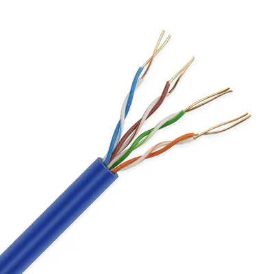
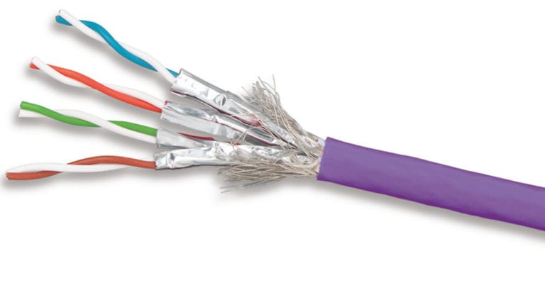
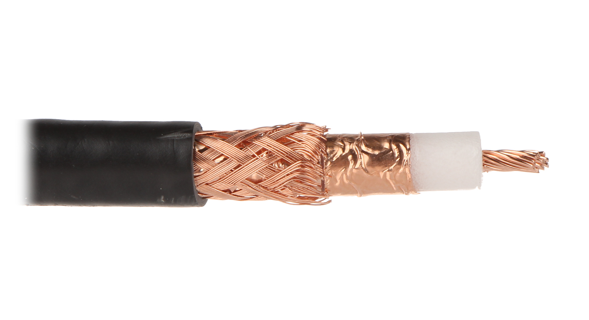
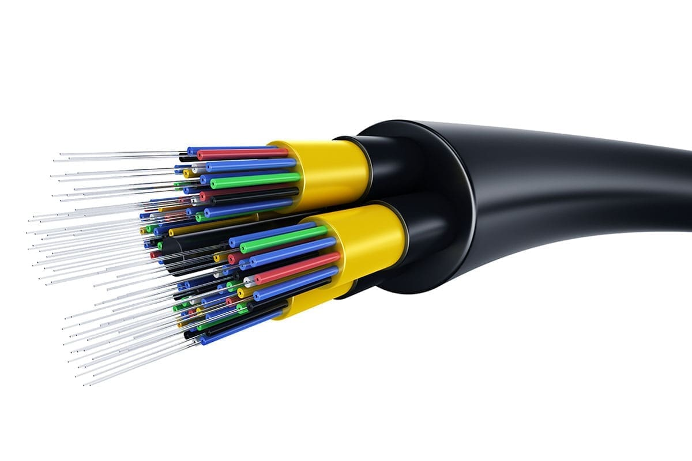
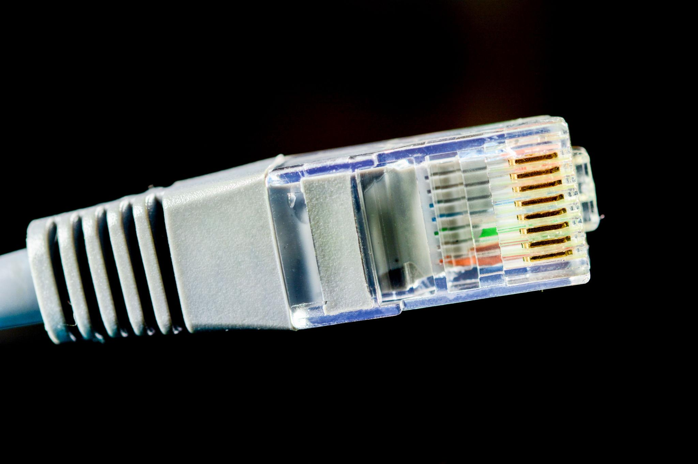
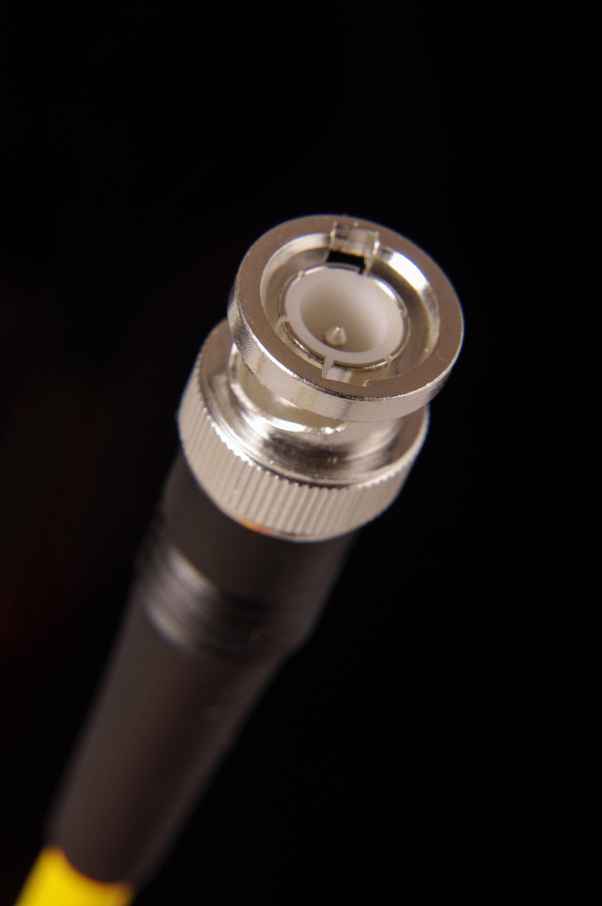

# EXPERIMENT - 01

## Title:

Study of Networking Cables and Connectors

## Aim/Objective:

To identify different types of networking cables and connectors.

## Theory:

Networking cables are used to transmit data between devices. Common types include:

#### Twisted Pair Cable

A twisted pair cable is a type of networking cable in which two insulated copper wires are twisted together to reduce electromagnetic interference and crosstalk. It is widely used in LANs for Ethernet communication and comes in two main types: UTP (Unshielded Twisted Pair) and STP (Shielded Twisted Pair). Twisting improves signal quality, making it reliable and cost-effective for data transmission over short to medium distances.

1. <b><u>Unshielded Twisted Pair Cables(UTP):</u></b> An Unshielded Twisted Pair (UTP) cable is a common type of twisted pair cable that does not have additional shielding around the wires. It consists of pairs of copper wires twisted together to reduce interference and is widely used in Ethernet networks like Cat5, Cat5e, and Cat6. UTP cables are lightweight, flexible, cost-effective, and easy to install, making them the most popular choice for home and office networking, although they are more susceptible to electromagnetic interference compared to shielded cables.

 
   
  <em>Unshielded Twisted Pair Cables</em>

2. <b><u>Shielded Twisted Pair Cables (STP):</u></b> A Shielded Twisted Pair (STP) cable is a type of twisted pair cable that includes extra shielding (foil or braided metal) around the wire pairs to protect against electromagnetic interference (EMI) and crosstalk. It is commonly used in environments with high electrical noise, such as industrial areas or near heavy machinery. Although STP cables provide better signal quality and higher reliability, they are more expensive, thicker, and slightly harder to install compared to UTP cables.

 
   
  <em>Shielded Twisted Pair Cables</em>

#### Coaxial Cable
A coaxial cable is a type of transmission cable that consists of a central copper conductor, surrounded by an insulating layer, a metallic shield, and an outer protective jacket. This design helps reduce signal interference and maintain signal quality over longer distances. Coaxial cables are commonly used in cable TV, internet connections, and CCTV systems, offering better shielding and performance compared to twisted pair cables.

 
   
  <em>Coaxial Cable</em>

#### Fiber Optic Cable

A fiber optic cable is a high-speed transmission medium that uses light signals instead of electrical signals to transmit data through thin strands of glass or plastic fibers. It offers very high bandwidth, faster data transmission, and minimal signal loss over long distances. Fiber optic cables are widely used in internet backbones, telecommunications, and high-speed networks, and are highly resistant to electromagnetic interference, making them more reliable than copper cables.

 
   
  <em>Fiber Optic Cable</em>

#### RJ45 Connector

An RJ45 (Registered Jack 45) is a standard connector used to terminate Ethernet cables like Cat5, Cat5e, and Cat6. It has 8 pins that connect to the 8 wires inside a twisted pair cable, enabling data transmission in LAN networks. RJ45 connectors are commonly used to connect computers, switches, and routers, and are essential for establishing wired network connections.

 
   
  <em>RJ45 Connector</em>

#### BNC Connector
A BNC (Bayonet Neill–Concelman) connector is a type of coaxial cable connector that uses a bayonet locking mechanism for quick and secure connections. It is commonly used in CCTV systems, radio frequency applications, and older Ethernet networks. BNC connectors provide reliable signal transmission with good shielding, making them suitable for high-frequency signals and video connections.

 
   
  <em>BNC Connector</em>

## Apparatus/Equipments/Softwares:

- UTP Cable
- STP Cable
- Coaxial Cable
- Fiber Cable
- RJ45 Connectors
- BNC Connector

## Procedure:

1. Observe different cables physically
2. Identify connectors used
3. Note structure and purpose of each cable

## Observation:

Different types of cables and connectors were identified successfully.

## Viva Questions:

1. What is UTP cable?
2. What is RJ45 connector?
3. Which cable is fastest?
