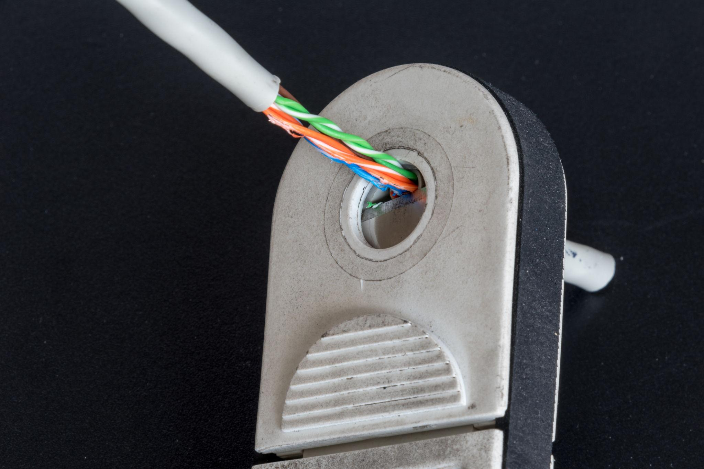
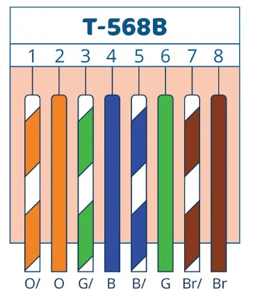
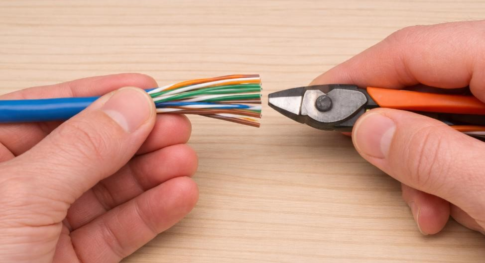
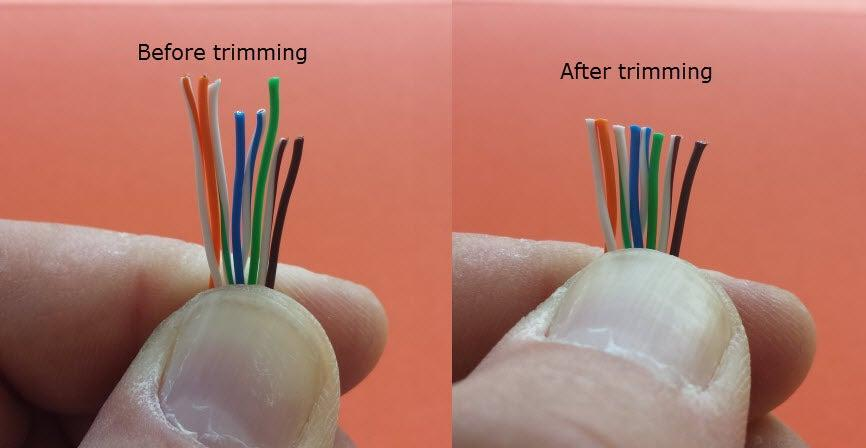
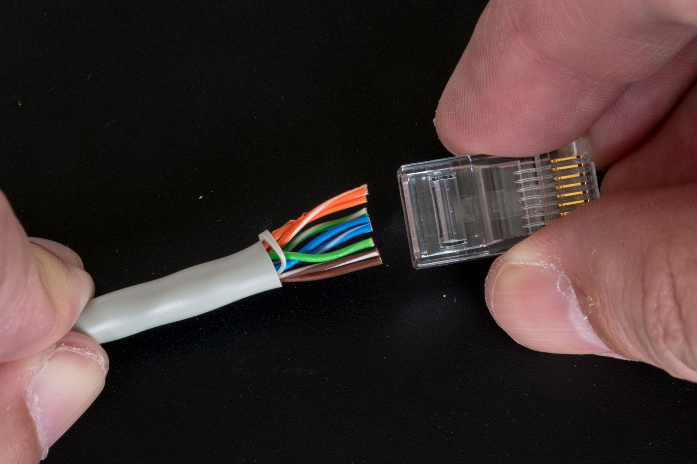
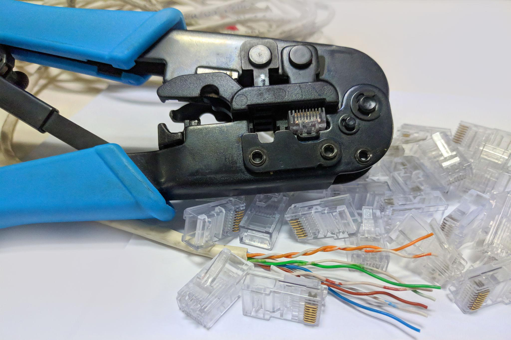

# EXPERIMENT - 03

## Title:

Making Patch Cable (Crimping)

## Aim/Objective:

To create a LAN cable using crimping tool.

## Theory:

Crimping is the process of attaching connectors to cable ends using standards like T568A and T568B.

## Apparatus/Equipments/Softwares:

- UTP Cable
- RJ45 Connectors
- Crimping Tool

## Procedure:

**Step 1: Strip the Outer Insulation**

- Use a wire stripper or crimping tool
- Remove about 1–1.5 inches of the outer jacket

 
   
  <em>Strip the Outer Insulation</em>

**Step 2: Untwist and Arrange Wires (T568B Standard)**

<ul>
<li>Arrange wires in this exact T568B color order (left → right):</li>
<ol>
<li>White-Orange</li>
<li>Orange</li>
<li>White-Green</li>
<li>Blue</li>
<li>White-Blue</li>
<li>Green</li>
<li>White-Brown</li>
<li>Brown</li>
</ol>
<li>Straighten and align them neatly</li>
</ul>

 
   
  <em>T568B color order</em>

**Step 3: Trim the Wires Evenly**

- Cut wires to equal length (about 1–1.5 cm)
- Ensure all wires are perfectly aligned

 
   
  <em>Trim the Wires Evenly</em>

 
   
  <em>Before Trimming and After Trimming</em>

**Step 4: Insert Wires into RJ45 Connector**

- Hold RJ45 clip facing downward
- Insert wires fully into connector
- Ensure each wire reaches the end and stays in order

 
   
  <em>Insert Wires into RJ45 Connector</em>

**Step 5: Crimp the Connector**

- Place connector into crimping tool
- Press firmly until it clicks
- Pins will pierce wires to make contact

 
   

## Observation:

Patch cable was successfully created.

## Viva Questions:

1. What is crimping?
2. What is T568B standard?
