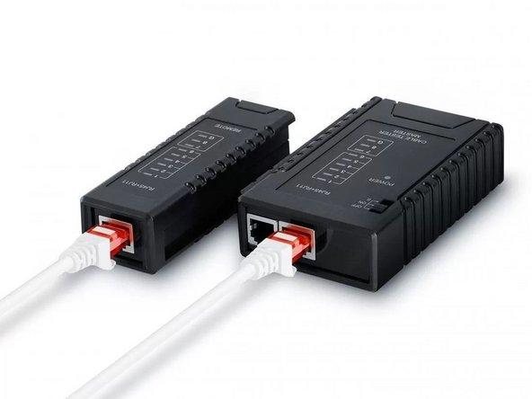
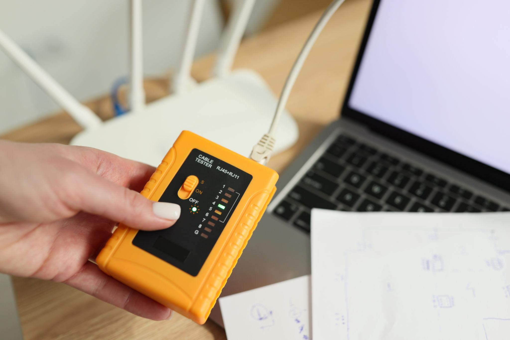

# EXPERIMENT - 04

## Title:

Testing of Network Cable

## Aim/Objective:

To test LAN cable using cable tester.

## Theory:

Cable testers check continuity, faults, and correct wiring of cables.

## Apparatus/Equipments/Softwares:

- Cable Tester

## Procedure:

**Step 1: Connect Cable to Tester**

- Plug one end of the cable into the main unit
- Plug the other end into the remote unit
- Ensure both ends are securely connected

 
  

**Step 2: Turn On the Tester**

- Switch ON the tester
- Some testers have modes: Auto / Manual / Slow
- Choose Auto mode for continuous testing

 
  

**Step 3: Observe LED Sequence**

- LEDs will glow in sequence: 1 → 2 → 3 → 4 → 5 → 6 → 7 → 8
- Both main and remote unit should show the same order

**Step 4: Identify Faults (if any)**

Common faults:

- Open circuit → LED does not glow
- Short circuit → Multiple LEDs glow together
- Crossed wires → Wrong sequence (e.g., 1→3→2)
- Miswiring → LEDs mismatch between main & remote

**Step 5: Confirm Cable Status**

- All LEDs in correct order → Cable is GOOD
- Any mismatch → Cable is FAULTY

## Observation:

Cable showed proper continuity and working condition.

## Viva Questions:

1. What is continuity?
2. What is cable fault?
