# EXPERIMENT - 05

## Title:

IP Address Configuration

## Aim/Objective:

To configure IP address, gateway and DNS.

## Theory:

IP address uniquely identifies a device in a network. Gateway connects networks and DNS resolves domain names.

## Apparatus/Equipments/Softwares:

- PC / Laptop

## Procedure:

**Step 1: Open Network Settings**

- Go to Control Panel → Network and Internet → Network and Sharing Center
- Click Change adapter settings
- Right-click Ethernet / Wi-Fi → Properties

<p align="center"> 
  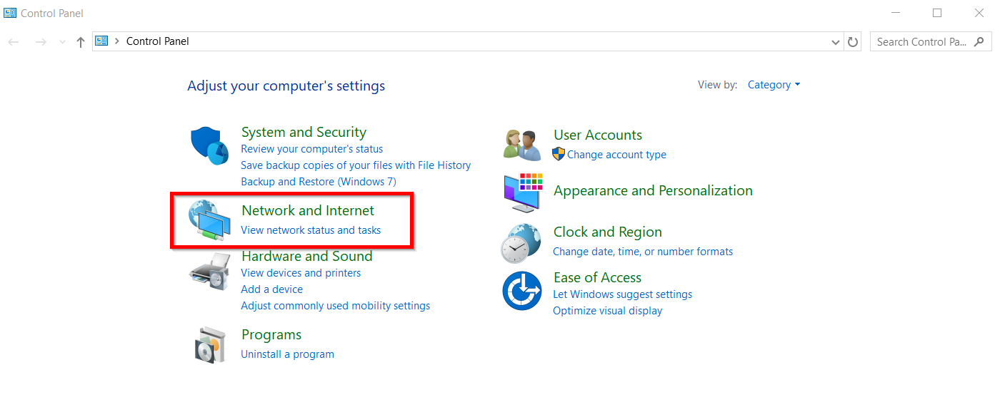
</p>
<p align="center"> 
  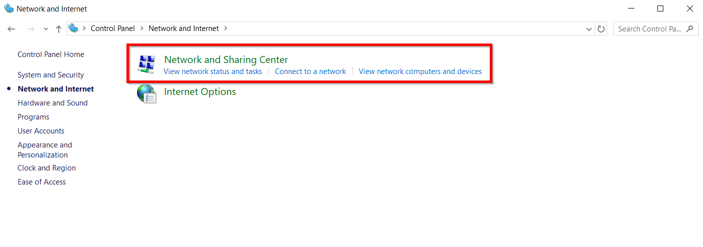
</p>
<p align="center"> 
  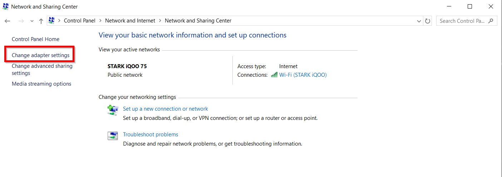
</p>
<p align="center"> 
  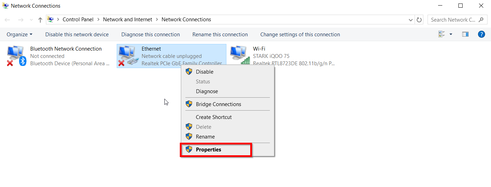
</p>

**Step 2: Select IPv4 Settings**

- Select Internet Protocol Version 4 (IPv4)
- Click Properties

<p align="center"> 
  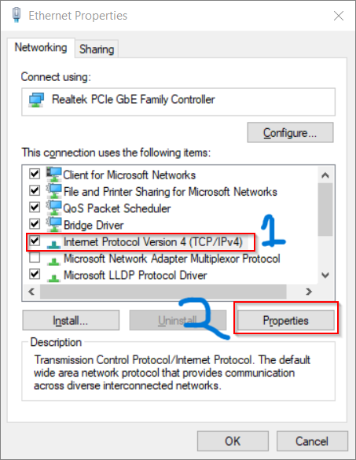
</p>

**Step 3: Set IP Address Manually**

Choose “Use the following IP address” and enter:

- IP Address: 10.133.133.150
- Subnet Mask: 255.255.255.0
- Default Gateway: 10.133.133.191

These values depend on your network

<p align="center"> 
  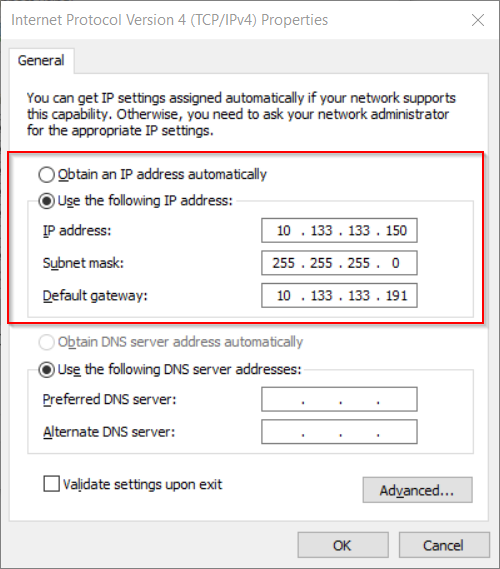
</p>

**Step 4: Configure DNS Server**

Select “Use the following DNS server addresses”:

- Preferred DNS: 8.8.8.8
- Alternate DNS: 8.8.4.4

These are public DNS servers (Google DNS)

<p align="center"> 
  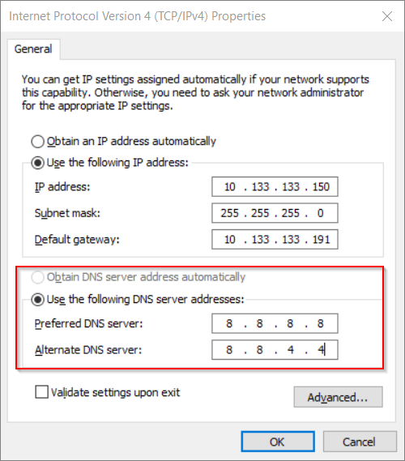
</p>

**Step 5: Save Settings**

- Click OK → Close
- Your IP configuration is now applied

<p align="center"> 
  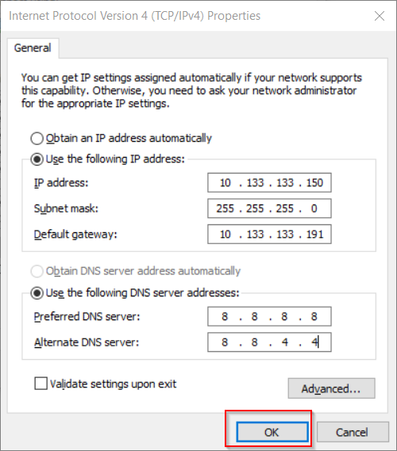
</p>

**Step 6: Test Using Ping**

- Open Command Prompt

- Run:
  ```cmd
  ping 10.133.133.191
  ping 8.8.8.8
  ping google.com
  ```
- Reply received → Configuration is correct
- Request timed out → Check settings

<p align="center"> 
  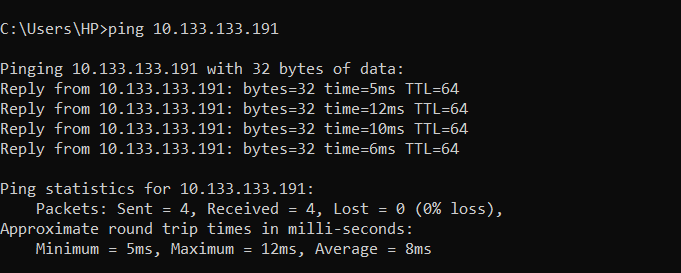
</p>
<p align="center"> 
  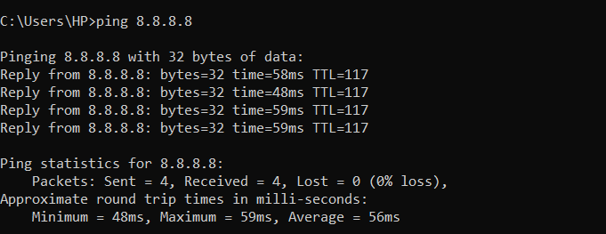
</p>
<p align="center"> 
  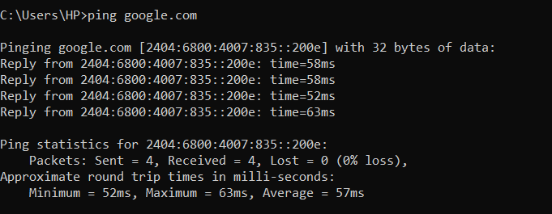
</p>

## Observation:

IP configuration was successful and connectivity verified.

## Viva Questions:

1. What is IP address?
2. What is DNS?
