# EXPERIMENT - 06

## Title:

Study of Networking Devices

## Aim/Objective:

To study various networking devices.

## Theory:

Devices like repeater, hub, bridge, switch, router, gateway, access point, firewall, Network Interface Card (NIC) etc help in communication between devices.

#### Repeater

A repeater is a basic networking device that receives weak or degraded signals, regenerates them, and retransmits them to extend the distance of a network. It operates at the Physical Layer (Layer 1) of the OSI model and does not analyze or filter data—it simply boosts the signal strength. Repeaters are commonly used in both wired and wireless networks, such as Wi-Fi range extenders, to improve coverage in large areas.

 
  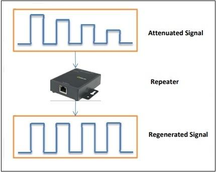

 
  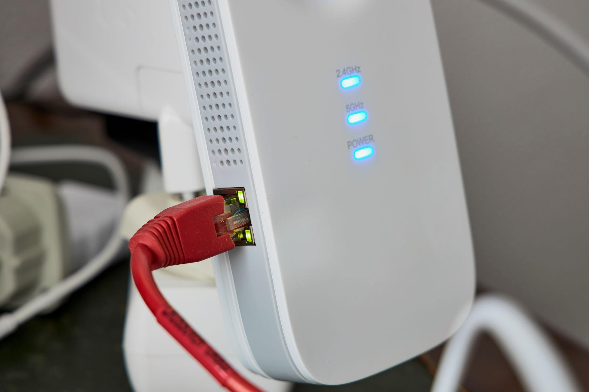

 
  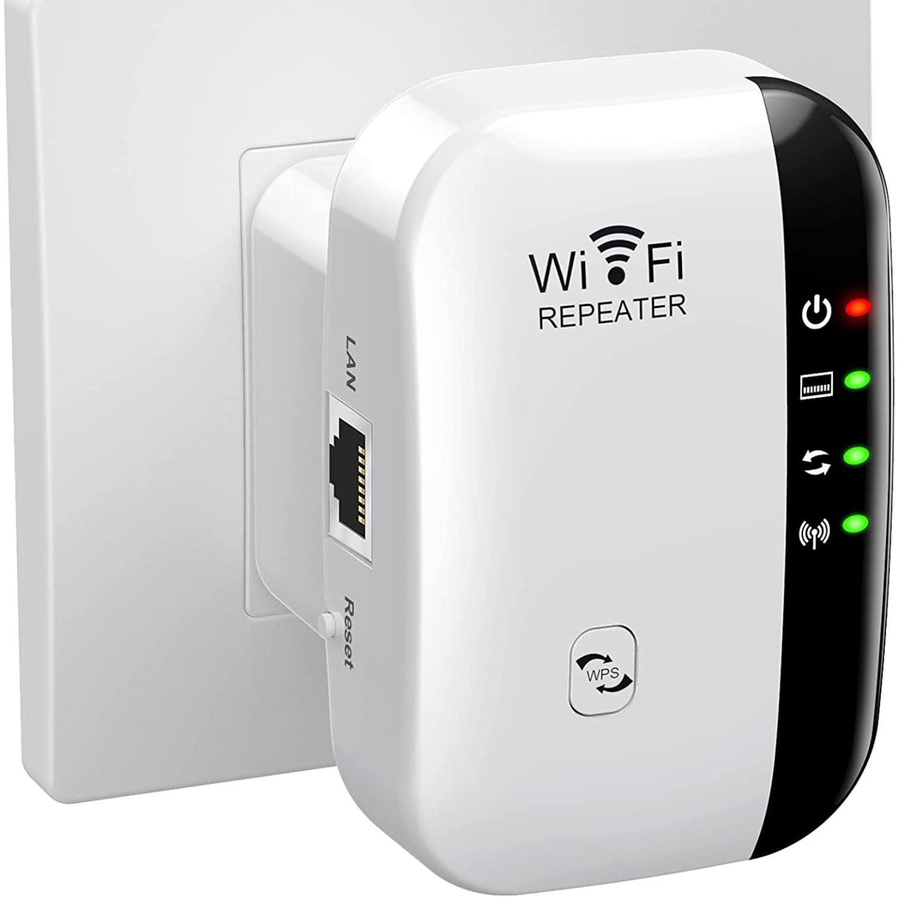

#### Hub

A hub is a basic networking device used to connect multiple computers in a local area network (LAN). It works at the Physical Layer (Layer 1) and simply broadcasts incoming data to all connected devices, without checking the destination address. Because of this, hubs are inefficient and can cause network congestion. They are now mostly outdated and have been replaced by switches, which provide smarter data transmission.

 
  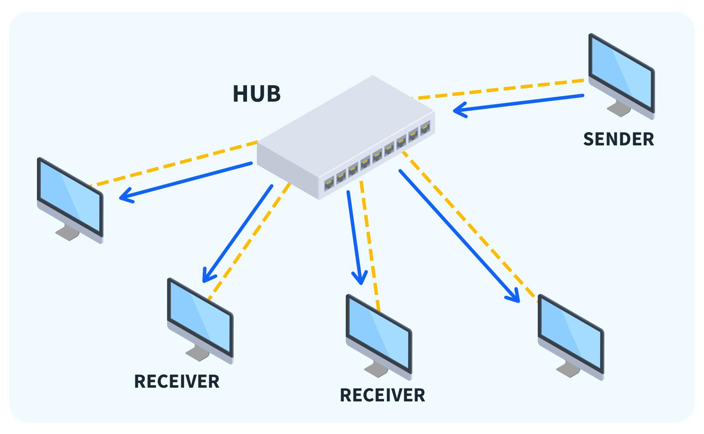

 
  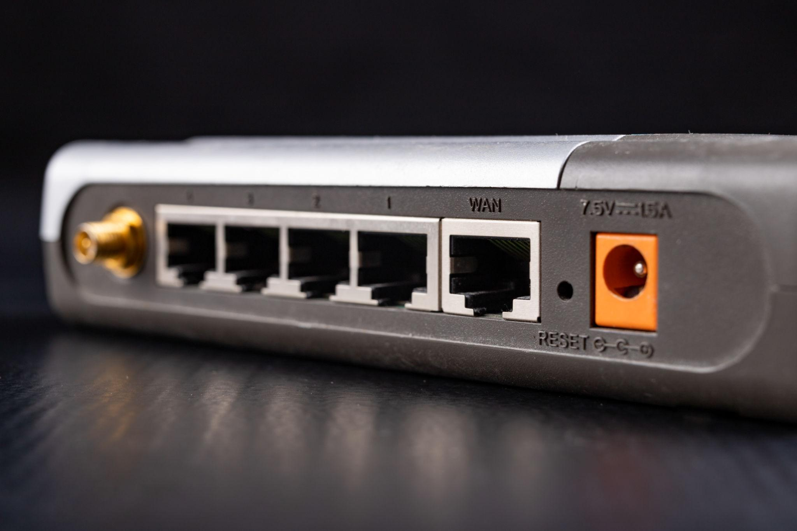

#### Bridge

A bridge is a networking device that connects two or more LAN segments and controls data flow between them. It operates at the Data Link Layer (Layer 2) and uses MAC addresses to decide whether to forward or block traffic, helping reduce unnecessary data transmission. By segmenting a network, a bridge improves performance and minimizes collisions, making communication more efficient compared to hubs.

 
  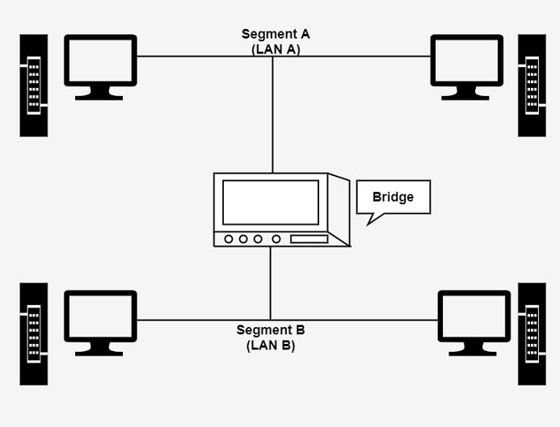

#### Switch

A switch is a networking device that connects multiple devices within a LAN and forwards data only to the intended recipient instead of broadcasting to all devices. It operates mainly at the Data Link Layer (Layer 2) and uses a MAC address table to intelligently direct traffic. This reduces network congestion and improves performance, making switches far more efficient than hubs in modern networks.

 
  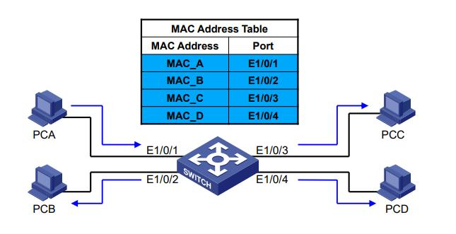

 
  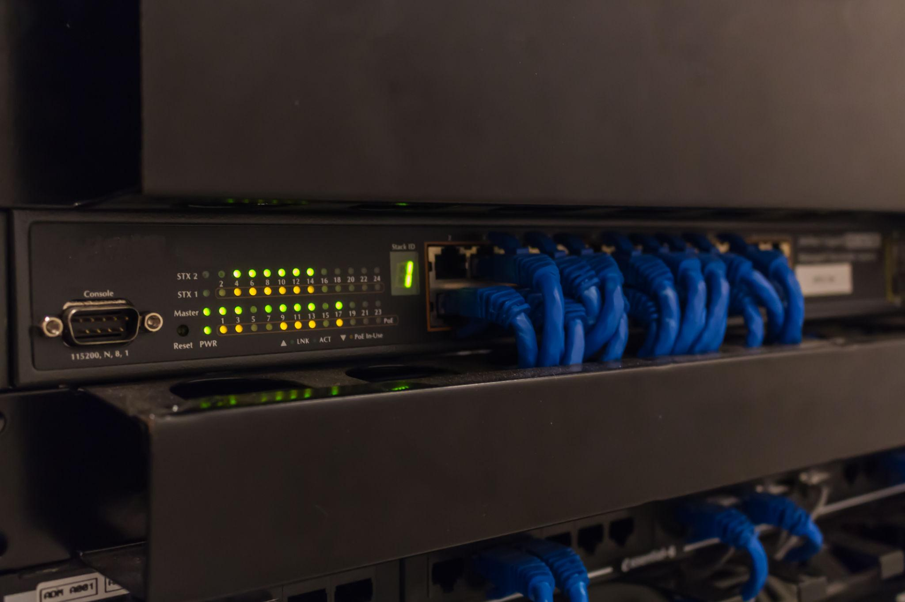

#### Router

A router is a networking device that connects different networks, such as a local area network (LAN) to the internet, and forwards data packets based on IP addresses. It operates at the Network Layer (Layer 3) and determines the best path for data to travel between networks. Routers are commonly used in homes and offices to provide internet access and often include additional features like Wi-Fi and basic security.

 
  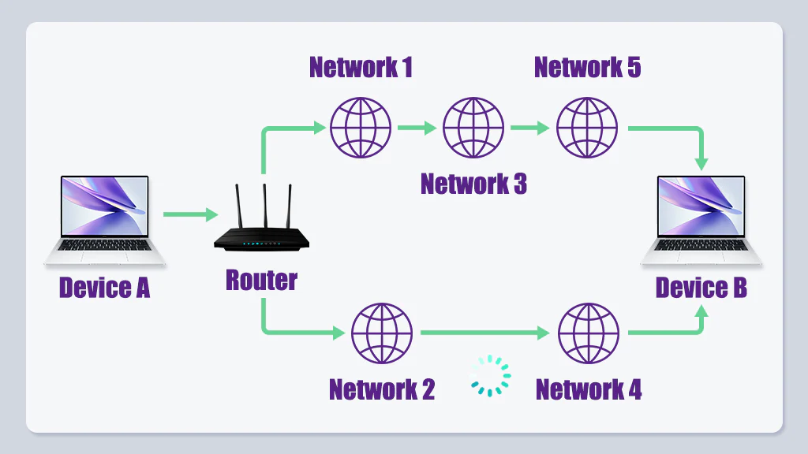

 
  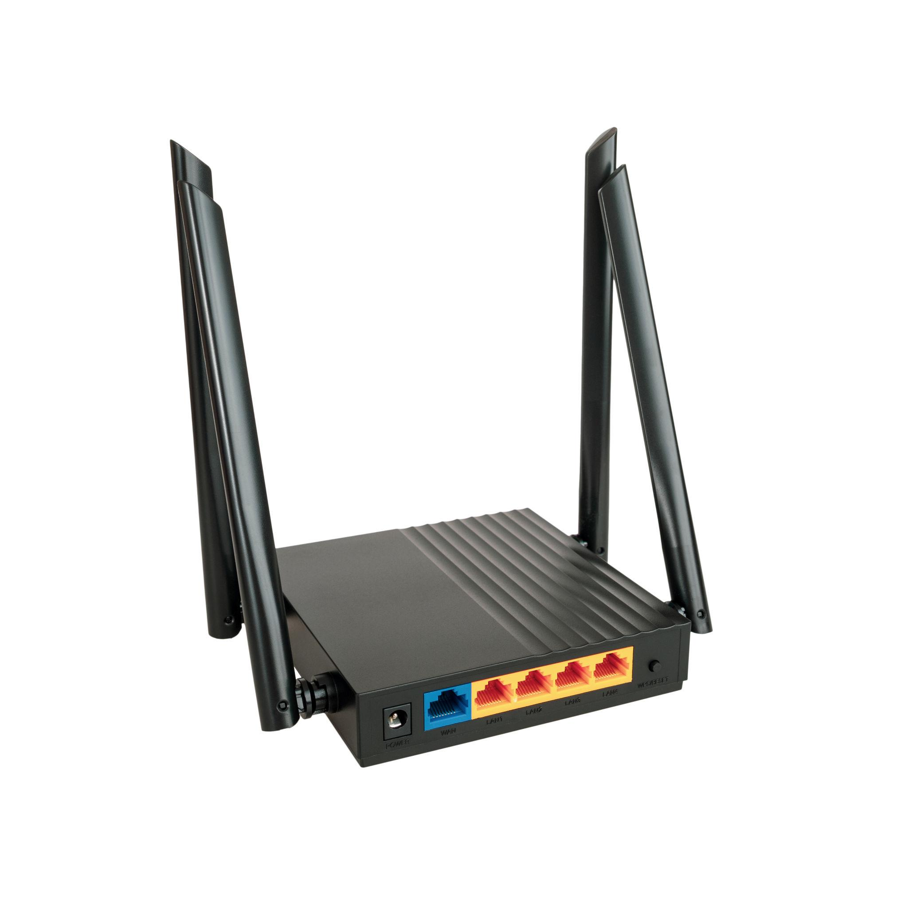

#### Gateway

A gateway is a networking device that acts as a bridge between different networks using different protocols, enabling them to communicate with each other. It operates across multiple layers of the OSI model and can perform tasks like protocol conversion, data translation, and routing. In most networks, the router also serves as the default gateway, allowing devices in a local network to access external networks like the internet.

 
  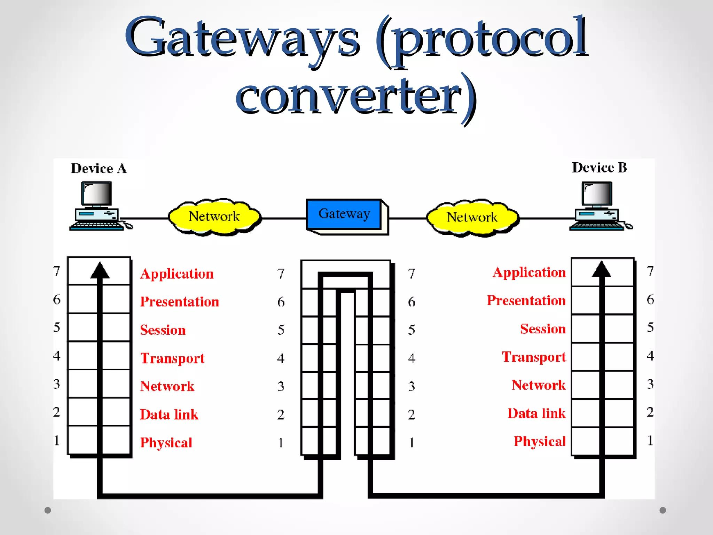

 
  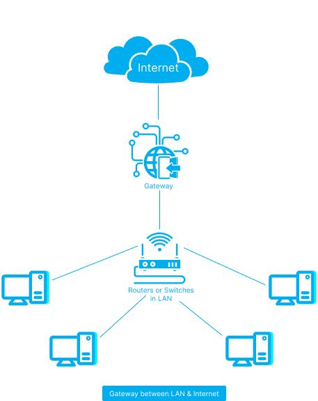

#### Access Point (AP)

An access point (AP) is a networking device that provides wireless connectivity by allowing Wi-Fi-enabled devices (like laptops and smartphones) to connect to a wired network. It operates mainly at the Data Link Layer (Layer 2) and acts as a bridge between wired and wireless networks. Access points are commonly used in homes, offices, and public spaces to extend Wi-Fi coverage and improve network accessibility.

 
  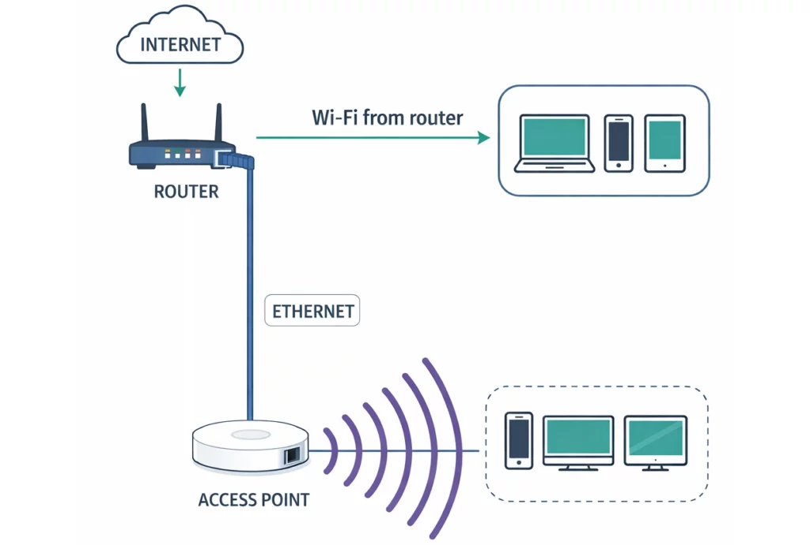

 
  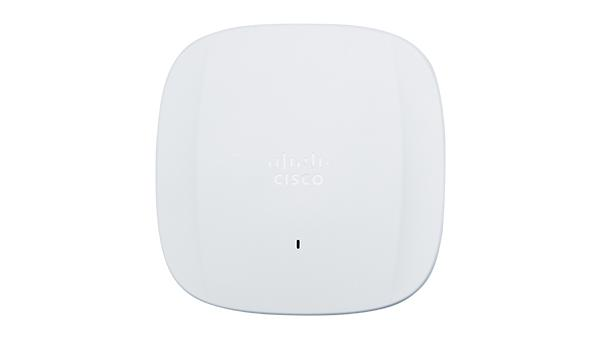

#### Firewall

A firewall is a network security device that monitors and controls incoming and outgoing traffic based on predefined security rules. It helps protect networks from unauthorized access, cyberattacks, and malware by allowing or blocking data packets. Firewalls can be hardware-based or software-based and operate across multiple layers of the OSI model, ensuring safe communication between internal and external networks.

 
  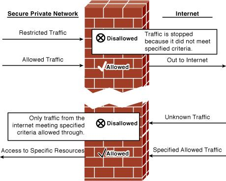

 
  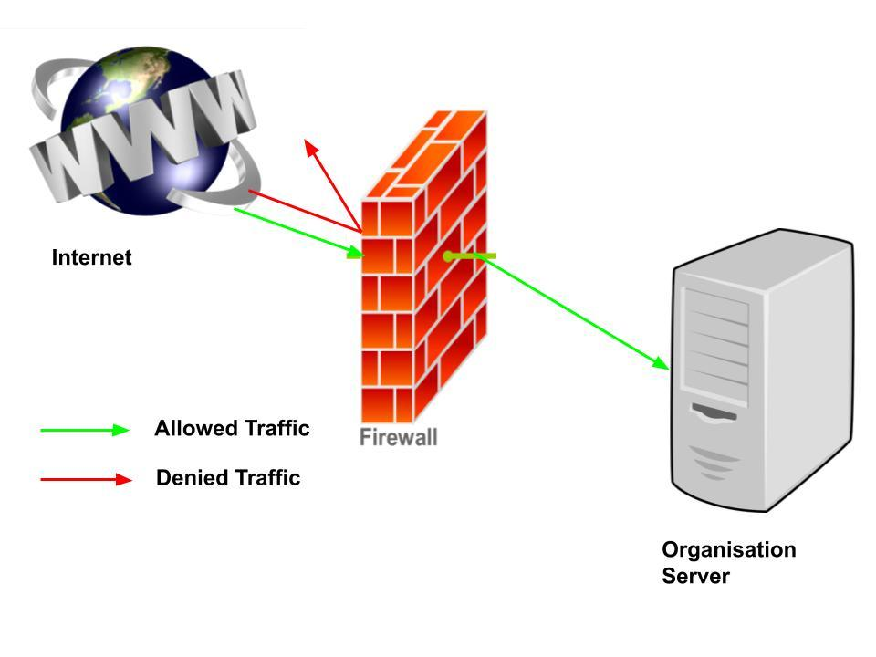

 
  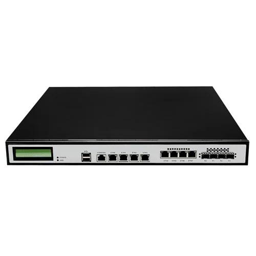

#### Network Interface Card (NIC)

A Network Interface Card (NIC) is a hardware component that connects a computer or device to a network. It can be wired (Ethernet) or wireless (Wi-Fi) and provides a unique MAC address used for identification in a network. The NIC operates mainly at the Data Link Layer (Layer 2) and enables devices to send and receive data over the network.

 
  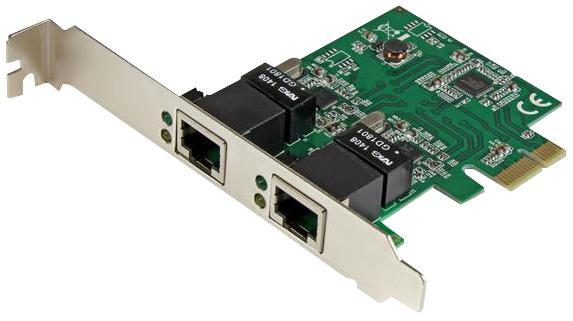

 
  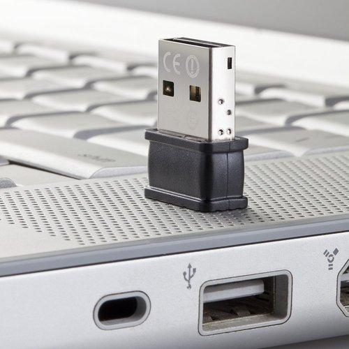

## Apparatus/Equipments/Softwares:

- Repeater
- Hub
- Bridge
- Switch
- Router
- Gateway
- Access Point (AP)
- Firewall
- Network Interface Card (NIC)

## Procedure:

1. Observe devices
2. Note their functions

## Observation:

Different networking devices and their uses were understood.

## Viva Questions:

1. What is router?
2. Difference between hub and switch?
