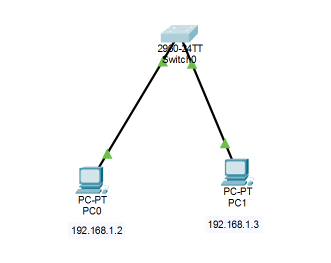
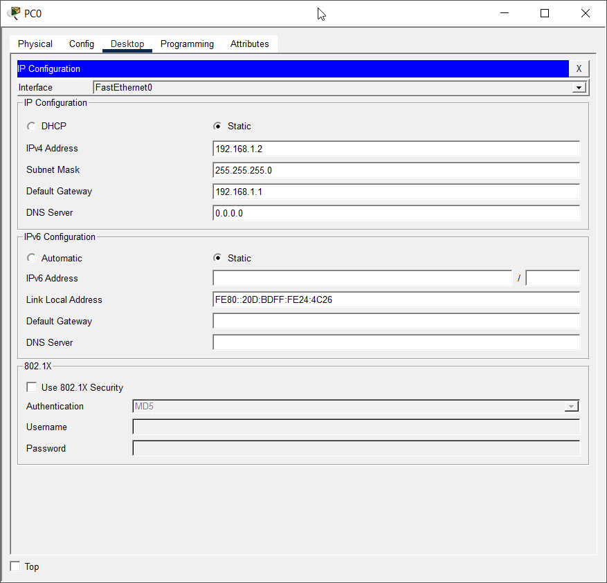
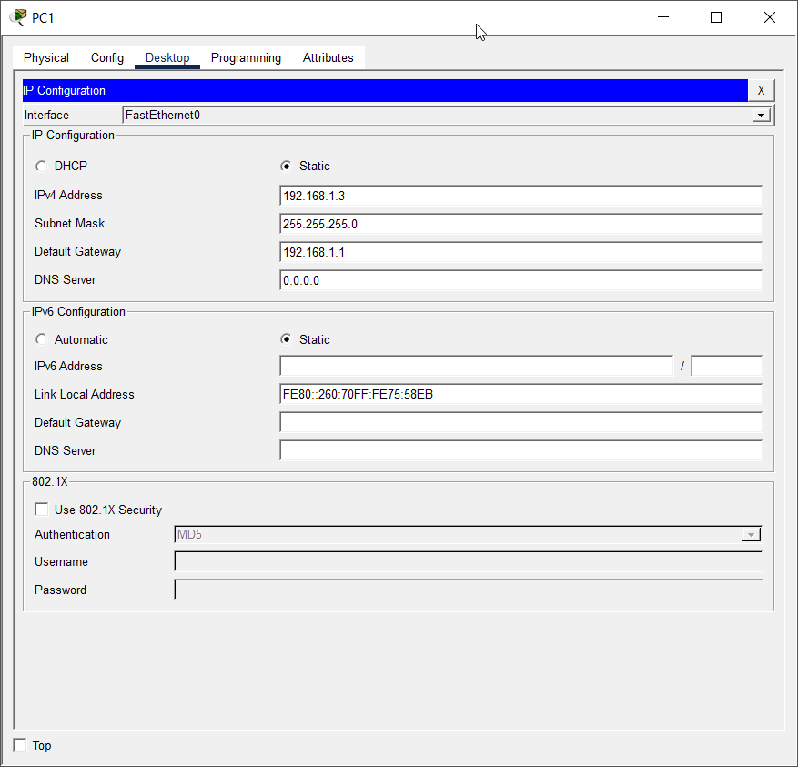
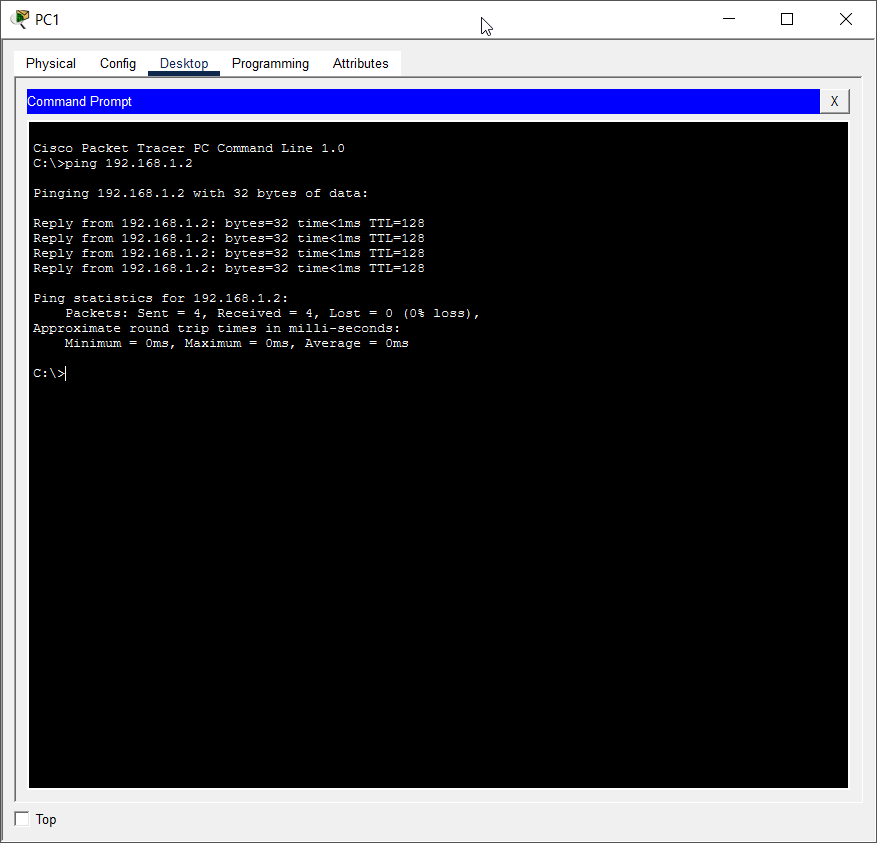

# EXPERIMENT - 08

## Title:

Network Simulation using Packet Tracer

## Aim/Objective:

To simulate a computer network using software and test connectivity between devices.

## Theory:

Network simulation is the process of designing and testing a network virtually using software tools.
It helps in understanding how devices communicate without needing real hardware.

Cisco Packet Tracer is widely used for:

- Designing network topologies
- Configuring devices (router, switch, PC)
- Testing connectivity using commands like ping

Advantages:

- Cost-effective
- Safe environment
- Easy to modify

## Apparatus/Equipments/Softwares:

- Computer System
- Cisco Packet Tracer

## Procedure:

<ol>
<li>Open Cisco Packet Tracer</li>
<li>Drag and drop devices:</li>
<ul>
<li>PCs</li>
<li>Switch / Router</li>
</ul>
<li>Connect devices using appropriate cables</li>
<li>Assign IP addresses to each device</li>
<li>Configure router (if used)</li>
<li>Open Command Prompt on PC</li>
<li>Use ping command to test connectivity</li>
</ol>

## Practical Setup (Example)

#### Topology:

- 2 PCs + 1 Switch

<p align="center"> 
  <br>
</p>

#### IP Configuration:

- PC1: 192.168.1.2
- PC2: 192.168.1.3
- Subnet Mask: 255.255.255.0
<p align="center"> 
  <br>
</p>
<p align="center"> 
  <br>
</p>

#### Connectivity Test:

```cmd
ping 192.168.1.2
```
<p align="center"> 
  <br>
</p>

## Observation:

- Devices were successfully connected
- IP addresses were assigned correctly
- Ping test was successful
- Network simulation completed successfully

## Viva Questions:

1. What is simulation?
2. Why use Packet Tracer?
