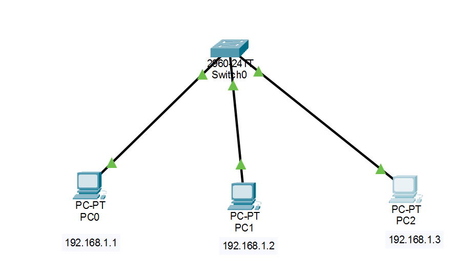
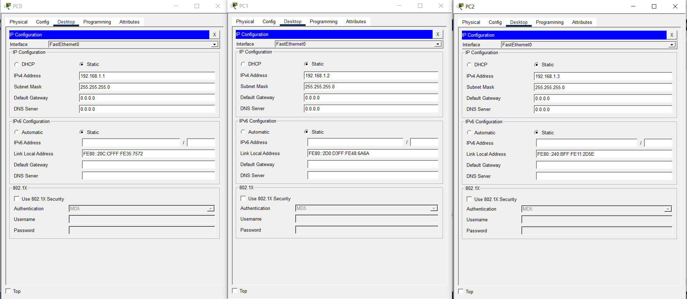
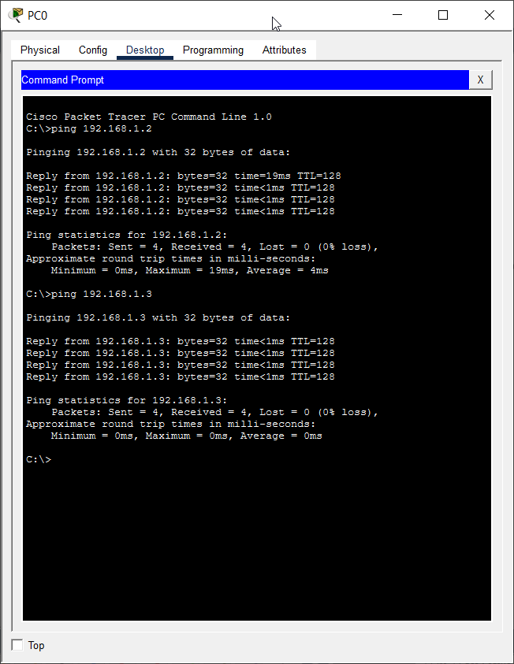

# EXPERIMENT - 09

## Title:

Setup of Wired LAN

## Aim/Objective:

To create and configure a Wired Local Area Network (LAN) using switches and PCs.

## Theory:

A Local Area Network (LAN) connects multiple devices within a limited area such as a lab, office, or home.
In a wired LAN, devices are connected using Ethernet cables and communicate through a switch.

- The switch forwards data using MAC addresses
- Communication is fast and secure compared to wireless
- Used in schools, offices, and labs

## Apparatus/Equipments/Softwares:

- PCs (2 or more)
- Network Switch
- LAN Cables (Ethernet – Straight-through) 🔌
- Cisco Packet Tracer

## Procedure:

1. Open Cisco Packet Tracer
2. Drag and place:
   - 1 Switch
   - 2–4 PCs
3. Connect each PC to the switch using Copper Straight-through cable
4. Assign IP addresses to each PC
5. Open Command Prompt on PC
6. Use `ping` command to test connectivity

## Practical Setup

#### Topology:

- 3 PCs connected to 1 Switch
<p align="center"> 
  <br>
</p>

#### IP Configuration:

| Device | IP Address  | Subnet Mask   |
| ------ | ----------- | ------------- |
| PC0    | 192.168.1.1 | 255.255.255.0 |
| PC1    | 192.168.1.2 | 255.255.255.0 |
| PC2    | 192.168.1.3 | 255.255.255.0 |

<p align="center"> 
  <br>
</p>

#### Testing Connectivity
On PC0:
```cmd
ping 192.168.1.2
ping 192.168.1.3
```
<p align="center"> 
  <br>
</p>

## Observation:

- PCs were successfully connected using Ethernet cables
- IP addresses were assigned correctly
- Ping command showed successful communication
- Wired LAN established successfully

## Viva Questions:

1. What is LAN?
2. What is MAC address?
