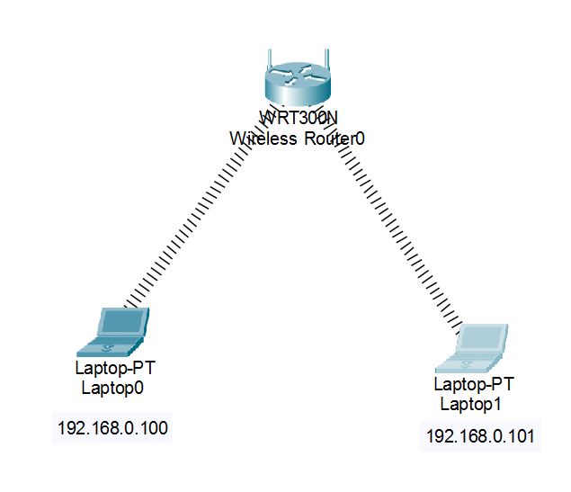
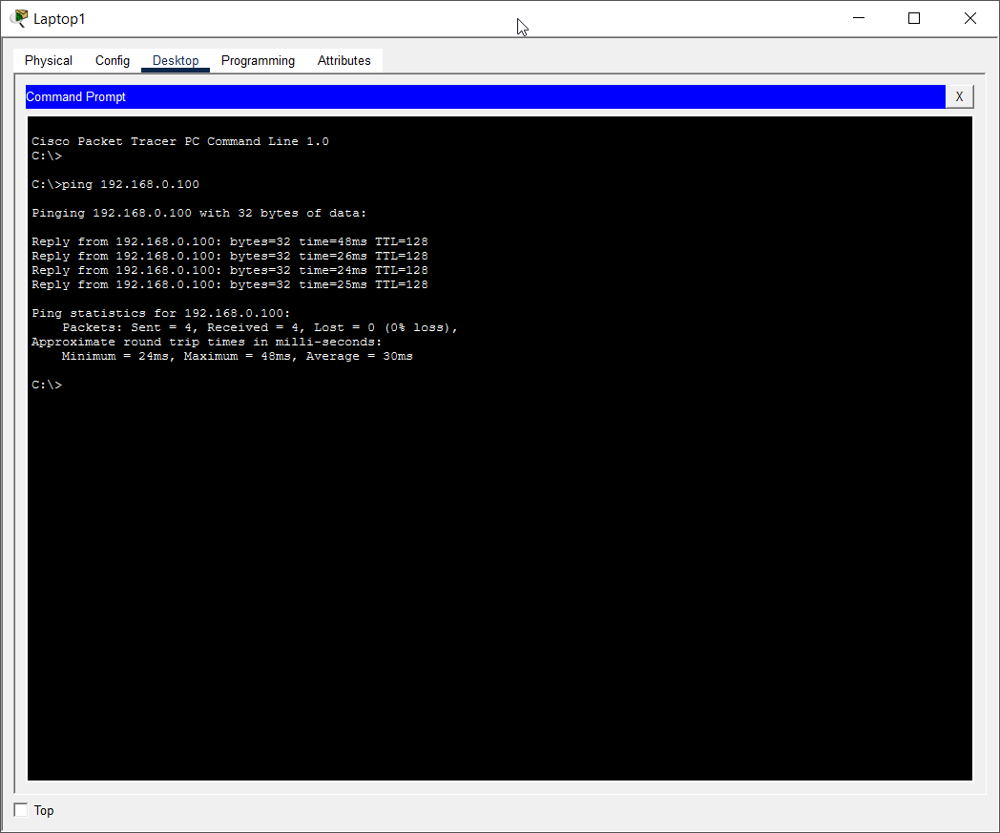

# EXPERIMENT - 10

## Title:

Setup of Wireless LAN

## Aim/Objective:

To configure and establish a Wireless Local Area Network (WLAN) using a wireless router and connect devices without cables.

## Theory:

A Wireless LAN (WLAN) connects devices using radio waves instead of cables.
Devices communicate through a Wireless Router or Access Point.

- Uses SSID (network name) to identify the network
- Uses security (WPA2 password) to protect access
- Provides mobility and flexibility

Common examples: Wi-Fi in homes, colleges, offices

## Apparatus/Equipments/Softwares:

- Wireless Router
- Laptops / PCs (with wireless capability)
- Cisco Packet Tracer

## Procedure:

1. Open Cisco Packet Tracer
2. Add:
   - 1 Wireless Router (e.g., WRT300N)
   - 2–3 Laptops
3. Click Wireless Router → GUI Tab
4. Configure:
   - SSID (e.g., MyWiFi)
   - Security Mode → WPA2
   - Password (e.g., 12345678)
5. On Laptop:
   - Desktop → PC Wireless
   - Select SSID (MyWiFi)
   - Enter password
6. Assign IP (DHCP or manual)
7. Test connectivity using ping

 
   

 
   

## Observation:

- Wireless router configured successfully
- Devices connected using SSID and password
- Communication between devices verified using ping
- Wireless network established successfully

## Viva Questions:

1. What is SSID?
2. Difference between wired and wireless LAN?
