# OSI (Open Systems Interconnection) Reference Model

An open system is a set of protocols that allows any two different systems to communicate regardless of their underlying architecture. The purpose of the OSI model is to show how to facilitate communication between different systems without requiring changes to the logic of the underlying hardware and software. The OSI model is not a protocol; it is a model for understanding and designing a network architecture that is flexible, robust, and interoperable.

The OSI model is a layered framework for the design of network systems that allows communication between all types of computer systems. It consists of seven separate but related layers, each of which defines a part of the process of moving information across a network (see _Figure 2.1.1_).

<p align="center">
  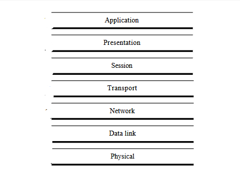<br>
  <em>Figure 2.1.1: Seven layers of the OSI model</em>
</p>

## Layered Architecture

The OSI model is composed of seven ordered layers:

- Layer 1 - Physical Layer,
- Layer 2 - Data Link Layer,
- Layer 3 - Network Layer,
- Layer 4 - Transport Layer,
- Layer 5 - Session Layer,
- Layer 6 - Presentation Layer,
- Layer 7 - Application Layer.

_Figure 2.1.2_ shows the layers involved when a message is sent from device A to device B. As the message travels from A to B, it may pass through many intermediate nodes. These intermediate nodes usually involve only the first three layers of the OSI model.

<p align="center">
  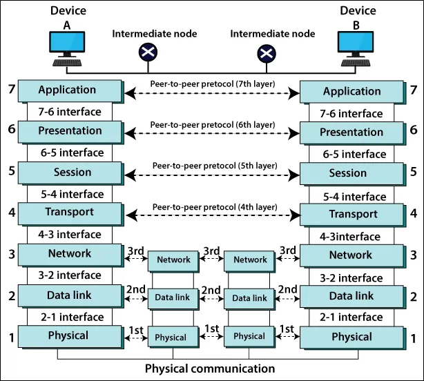<br>
  <em>Figure 2.1.2</em>
</p>

## Organization of the Layers

The seven layers can be thought of as belonging to 3 subgroups. Layers I, 2, and 3-physical, data link, and network-are the network support layers; they deal with the physical aspects of moving data from one device to another (such as electrical specifications, physical connections, physical addressing, and transport timing and reliability). Layers 5, 6, and 7-session, presentation, and application-can be thought of as the user support layers; they allow interoperability among unrelated software systems. Layer 4, the transport layer, links the two subgroups and ensures that what the lower layers have transmitted is in a form that the upper layers can use. The upper OSI layers are almost always implemented in software; lower layers are a combination of hardware and software, except for the physical layer, which is mostly hardware.

<p align="center">
  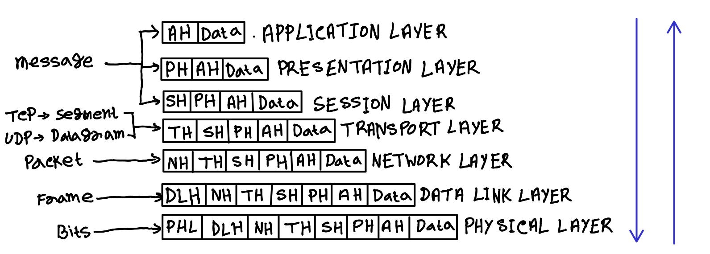<br>
  <em>Figure 2.1.3</em><br>
  <em>AH - Application Header; PH - Presentation Header; SH - Session Header; TH - Transport Header; NH - Network Header; DLH - Data Link Header; PHL - Physical Header</em>
</p>

The process starts at layer 7 (the application layer), then moves from layer to layer in descending, sequential order. At each layer, a header, or possibly a trailer, can be added to the data unit. Commonly, the trailer is added only at layer 2. When the formatted data unit passes through the physical layer (layer 1), it is changed into an electromagnetic signal and transported along a physical link.

Upon reaching its destination, the signal passes into layer 1 and is transformed back into digital form. The data units then move back up through the OSI layers. As each block of data reaches the next higher layer, the headers and trailers attached to it at the corresponding sending layer are removed, and actions appropriate to that layer are taken. By the time it reaches layer 7, the message is again in a form appropriate to the application and is made available to the recipient.

## Encapsulation

A packet (header and data) at level 7 is encapsulated in a packet at level 6. The whole packet at level 6 is encapsulated in a packet at level 5, and so on. In other words, the data portion of a packet at level $N - 1$ carries the whole packet (data and header and maybe trailer) from level $N$. The concept is called encapsulation; level $N - 1$ is not aware of which part of the encapsulated packet is data and which part is the header or trailer. For level $N - 1$, the whole packet coming from level $N$ is treated as one integral unit.

## LAYERS IN THE OSI MODEL

### Physical Layer

The physical layer coordinates the functions required to carry a bit stream over a physical medium. It deals with the mechanical and electrical specifications of the interface and transmission medium. It also defines the procedures and functions that physical devices and interfaces have to perform for transmission to Occur. _Figure 2.1.4_ shows the position of the physical layer with respect to the transmission medium and the data link layer.

```
The physical layer is responsible for movements of individual bits from one hop (node) to the next.
```

<p align="center">
  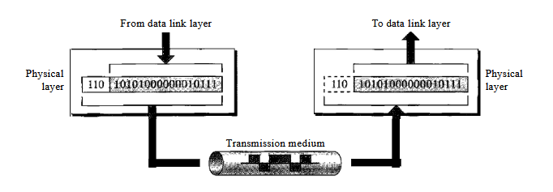<br>
  <em>Figure 2.1.4: Physical layer</em>
</p>

The physical layer is also concerned with the following:

- **Physical characteristics of interfaces and medium:** The physical layer defines the characteristics of the interface between the devices and the transmission medium. It also defines the type of transmission medium.

- **Representation of bits:** The physical layer data consists of a stream of bits (sequence of 0's or 1's) with no interpretation. To be transmitted, bits must be encoded into signals--electrical or optical. The physical layer defines the type of encoding (how 0's and 1's are changed to signals).

- **Data rate:** The transmission rate-the number of bits sent each second-is also defined by the physical layer. In other words, the physical layer defines the duration of a bit, which is how long it lasts.

- **Synchronization of bits:** The sender and receiver not only must use the same bit rate but also must be synchronized at the bit level. In other words, the sender and the receiver clocks must be synchronized.

- **Line configuration:** The physical layer is concerned with the connection of devices to the media. In a point-to-point configuration, two devices are connected through a dedicated link. In a multipoint configuration, a link is shared among several devices.

- **Transmission mode:** The physical layer also defines the direction of transmission between two devices: simplex, half-duplex, or full-duplex.

### Data Link Layer

The data link layer transforms the physical layer, a raw transmission facility, to a reliable link. It makes the physical layer appear error-free to the upper layer (networklayer). _Figure 2.1.5_ shows the relationship of the data link layer to the network and physical layers.

<p align="center">
  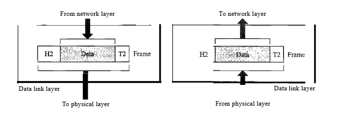<br>
  <em>Figure 2.1.5: Data Link Layer</em>
</p>

```
The data link layer is responsible for moving frames from one hop (node) to the next.
```

Responsibilities of the data link layer include the following:

- **Framing:** The data link layer divides the stream of bits received from the network layer into manageable data units called frames.

- **Physical addressing:** If frames are to be distributed to different systems on the network, the data link layer adds a header to the frame to define the sender and/or receiver of the frame. If the frame is intended for a system outside the sender's network, the receiver address is the address of the device that connects the network to the next one.

- **Flow control:** If the rate at which the data are absorbed by the receiver is less than the rate at which data are produced in the sender, the data link layer imposes a flow control mechanism to avoid overwhelming the receiver.

- **Error control:** The data link layer adds reliability to the physical layer by adding mechanisms to detect and retransmit damaged or lost frames. It also uses a mechanism to recognize duplicate frames. Error control is normally achieved through a trailer added to the end of the frame.

- **Access control:** When two or more devices are connected to the same link, data link layer protocols are necessary to determine which device has control over the link at any given time.

#### Hop-to-Hop (Node-to-Node) Delivery

<p align="center">
  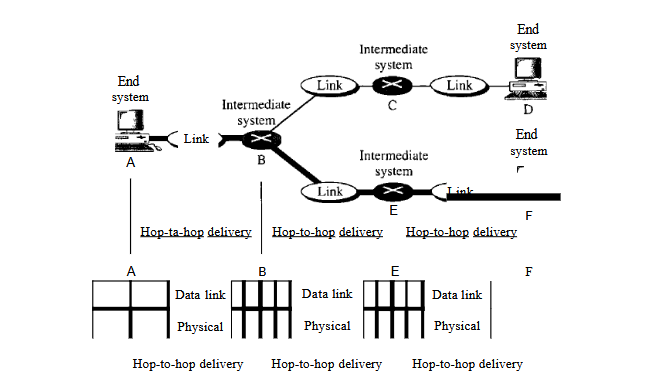<br>
  <em>Figure 2.1.6: Hop-to-hop delivery</em>
</p>

As the figure shows, communication at the data link layer occurs between two adjacent nodes. To send data from $A$ to $F$, three partial deliveries are made. First, the data link layer at A sends a frame to the data link layer at $B$ (a router). Second, the data link layer at $B$ sends a new frame to the data link layer at $E$. Finally, the data link layer at $E$ sends a new frame to the data link layer at $F$. Note that the frames that are exchanged between the three nodes have different values in the headers. The frame from $A$ to $B$ has $B$ as the destination address and $A$ as the source address. The frame from $B$ to $E$ has $E$ as the destination address and $B$ as the source address. The frame from $E$ to $F$ has $F$ as the destination address and $E$ as the source address. The values of the trailers can also be different if error checking includes the header of the frame.

### Network Layer

The network layer is responsible for the source-to-destination delivery of a packet, possibly across multiple networks (links). Whereas the data link layer oversees the delivery of the packet between two systems on the same network (links), the network layer ensures that each packet gets from its point of origin to its final destination.

If two systems are connected to the same link, there is usually no need for a network layer. However, if the two systems are attached to different networks (links) with connecting devices between the networks (links), there is often a need for the network layer to accomplish source-to-destination delivery. _Figure 2.1.7_ shows the relationship of the network layer to the data link and transport layers.

```
The network layer is responsible for the delivery of individual packets from the source host to the destination host.
```

<p align="center">
  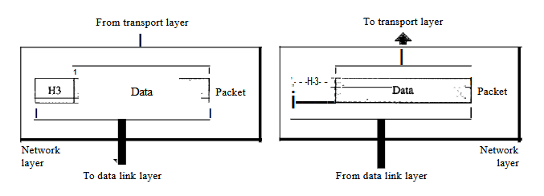<br>
  <em>Figure 2.1.7: Network layer</em>
</p>

Responsibilities of the network layer include the following:

- **Logical addressing.** The physical addressing implemented by the data link layer handles the addressing problem locally. If a packet passes the network boundary, we need another addressing system to help distinguish the source and destination systems. The network layer adds a header to the packet coming from the upper layer that, among other things, includes the logical addresses of the sender and receiver.

- **Routing:** When independent networks or links are connected to create intemetworks (network of networks) or a large network, the connecting devices (called routers or switches) route or switch the packets to their final destination. One of the functions of the network layer is to provide this mechanism.

#### Source-to-Destination Delivery

<p align="center">
  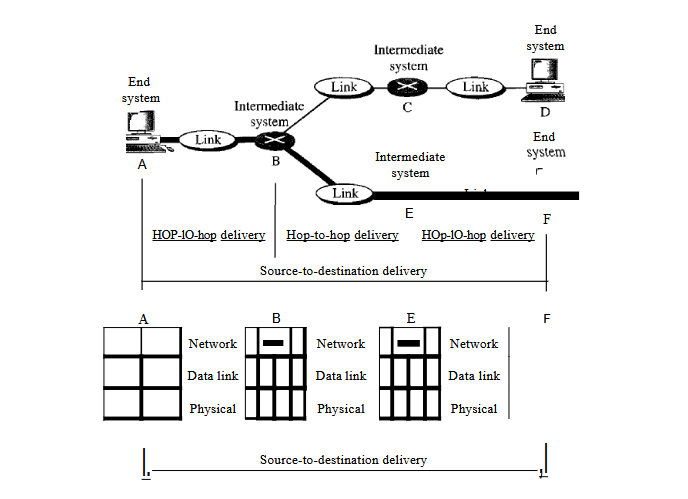<br>
  <em>Figure 2.1.8: Source-to-destination delivery</em>
</p>

As the figure shows, now we need a source-to-destination delivery. The network layer at $A$ sends the packet to the network layer at $B$. When the packet arrives at router $B$, the router makes a decision based on the final destination $(F)$ of the packet. Router $B$ uses its routing table to find that the next hop is router $E$. The network layer at $B$, therefore, sends the packet to the network layer at $E$. The network
layer at $E$, in tum, sends the packet to the network layer at $F$.

### Transport Layer

The transport layer is responsible for process-to-process delivery of the entire message. A process is an application program running on a host. Whereas the network layer oversees source-to-destination delivery of individual packets, it does not recognize any relationship between those packets. It treats each one independently, as though each piece belonged to a separate message, whether or not it does. The transport layer, on the other hand, ensures that the whole message arrives intact and in order, overseeing both error control and flow control at the source-to-destination level. _Figure 2.1.9_ shows the relationship of the transport layer to the network and session layers.

```
The transport layer is responsible for the delivery of a message from one process to another.
```

<p align="center">
  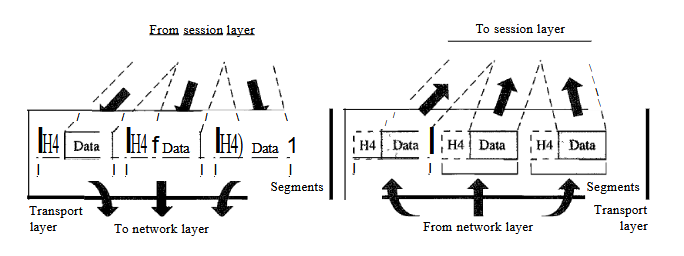<br>
  <em>Figure 2.1.9: Transport layer</em>
</p>

Responsibilities of the transport layer include the following:

- **Service-point addressing:** Computers often run several programs at the same time. For this reason, source-to-destination delivery means delivery not only from one computer to the next but also from a specific process (running program) on one computer to a specific process (running program) on the other. The transport layer header must therefore include a type of address called a service-point address (or port address). The network layer gets each packet to the correct computer; the transport layer gets the entire message to the correct process on that computer.

- **Segmentation and reassembly:** A message is divided into transmittable segments, with each segment containing a sequence number. These numbers enable the transport layer to reassemble the message correctly upon arriving at the destination and to identify and replace packets that were lost in transmission.

- **Connection control:** The transport layer can be either connectionless or connection oriented. A connectionless transport layer treats each segment as an independent packet and delivers it to the transport layer at the destination machine. A connection oriented transport layer makes a connection with the transport layer at the destination machine first before delivering the packets. After all the data are transferred, the connection is terminated.

- **Flow control:** Like the data link layer, the transport layer is responsible for flow control. However, flow control at this layer is performed end to end rather than across a single link.

- **Error control:** Like the data link layer, the transport layer is responsible for error control. However, error control at this layer is performed process-to-process rather than across a single link. The sending transport layer makes sure that the entire message arrives at the receiving transport layer without error (damage, loss, or duplication). Error correction is usually achieved through retransmission.

<p align="center">
  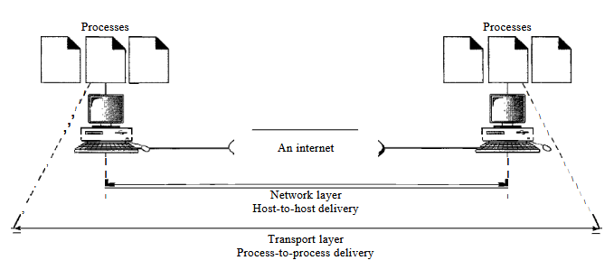<br>
  <em>Figure 2.1.10: Reliable process-to-process delivery of a message</em>
</p>

### Session Layer

The services provided by the first three layers (physical, data link, and network) are not sufficient for some processes. The session layer is the network dialog controller. It establishes, maintains, and synchronizes the interaction among communicating systems.

```
The session layer is responsible for dialog control and synchronization.
```

Responsibilities of the session layer include the following:

- **Dialog control:** The session layer allows two systems to enter into a dialog. It allows the communication between two processes to take place in either half-duplex (one way at a time) or full-duplex (two ways at a time) mode.

- **Synchronization:** The session layer allows a process to add checkpoints, or synchronization points, to a stream of data. For example, if a system is sending a file of $2000$ pages, it is advisable to insert checkpoints after every $100$ pages to ensure that each $100$-page unit is received and acknowledged independently. In this case, if a crash happens during the transmission of page $523$, the only pages that need to be resent after system recovery are pages $501$ to $523$. Pages previous to $501$ need not be resent. _Figure 2.1.11_ illustrates the relationship of the session layer to the transport and presentation layers.

<p align="center">
  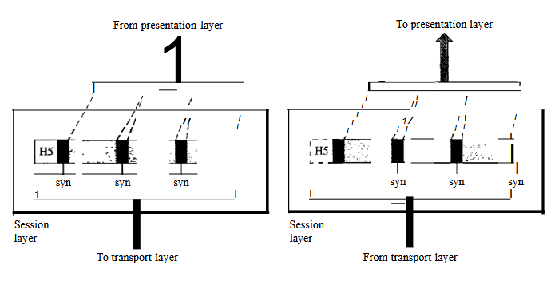<br>
  <em>Figure 2.1.11: Session layer</em>
</p>

### Presentation Layer

The presentation layer is concerned with the syntax and semantics of the information exchanged between two systems. _Figure 2.1.12_ shows the relationship between the presentation layer and the application and session layers.

<p align="center">
  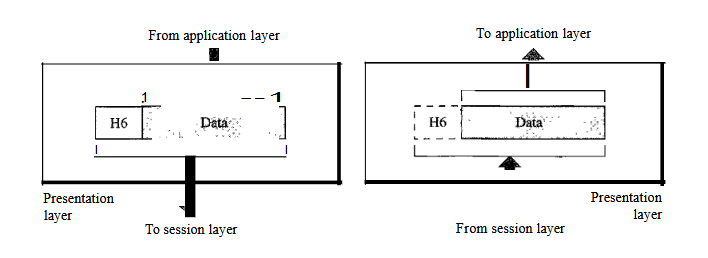<br>
  <em>Figure 2.1.12: Presentation Layer</em>
</p>

Responsibilities of the presentation layer include the following:

- **Translation:** The processes (running programs) in two systems are usually exchanging information in the form of character strings, numbers, and so on. The information must be changed to bit streams before being transmitted. Because different computers use different encoding systems, the presentation layer is responsible for interoperability between these different encoding methods. The presentation layer at the sender changes the information from its sender-dependent format into a common format. The presentation layer at the receiving machine changes the common format into its receiver-dependent format.

- **Encryption:** To carry sensitive information, a system must be able to ensure privacy. Encryption means that the sender transforms the original information to another form and sends the resulting message out over the network. Decryption reverses the original process to transform the message back to its original form.

- **Compression:** Data compression reduces the number of bits contained in the information. Data compression becomes particularly important in the transmission of multimedia such as text, audio, and video.

### Application Layer

The application layer enables the user, whether human or software, to access the network. It provides user interfaces and support for services such as electronic mail, remote file access and transfer, shared database management, and other types of distributed information services.

_Figure 2.1.13_ shows the relationship of the application layer to the user and the presentation layer. Of the many application services available, the figure shows only three: $XAOO$ (message-handling services), X.500 (directory services), and file transfer, access, and management (FTAM). The user in this example employs XAOO to send an e-mail message.

```
The application layer is responsible for providing services to the user
```

<p align="center">
  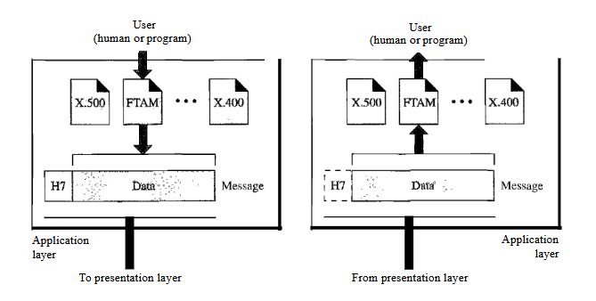<br>
  <em>Figure 2.1.13: Application Layer</em>
</p>

Specific services provided by the application layer include the following:

- **Network virtual terminal:** A network virtual terminal is a software version of a physical terminal, and it allows a user to log on to a remote host. To do so, the application creates a software emulation of a terminal at the remote host. The user's computer talks to the software terminal which, in turn, talks to the host, and vice versa. The remote host believes it is communicating with one of its own terminals and allows the user to log on.

- **File transfer, access, and management:** This application allows a user to access files in a remote host (to make changes or read data), to retrieve files from a remote computer for use in the local computer, and to manage or control files in a remote computer locally.

- **Mail services:** This application provides the basis for e-mail forwarding and storage.

- **Directory services:** This application provides distributed database sources and access for global information about various objects and services.

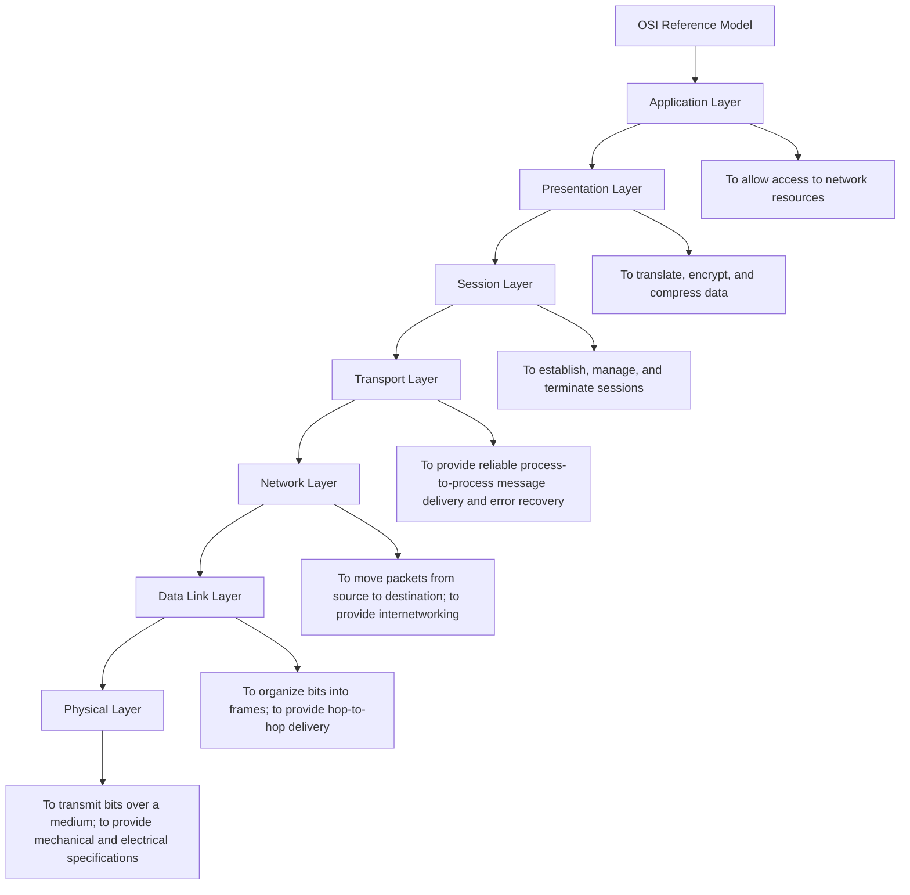
