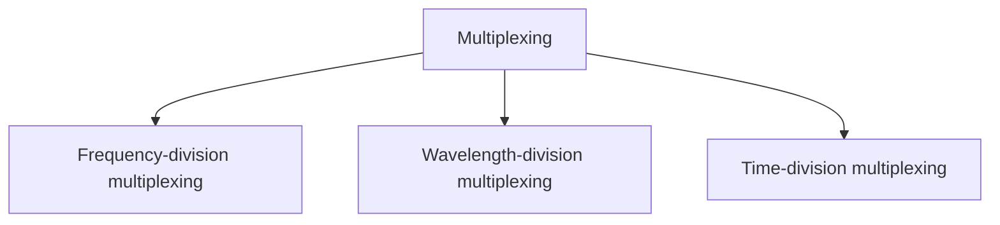

# Multiplexing

Multiplexing is the set of techniques that allows the simultaneous transmission of multiple signals across a single data link.

   
  <em>Figure 4.1.1: Dividing a link into channels</em>

In a multiplexed system, `n` lines share the bandwidth of one link. _Figure 4.1.1_ shows the basic format of a multiplexed system. The lines on the left direct their transmission streams to a multiplexer (MUX), which combines them into a single stream (many-to-one). At the receiving end, that stream is fed into a demultiplexer (DEMUX), which separates the stream back into its component transmissions (one-to-many) and directs them to their corresponding lines. In the figure, the word link refers to the physical path. The word channel refers to the portion of a link that carries a transmission between a given pair of lines. One link can have many `(n)` channels.

There are three basic multiplexing techniques:

- Frequency-division multiplexing,
- Wavelength-division multiplexing, and
- Time-division multiplexing

Frequency-division multiplexing and Wavelength-division multiplexing technique designed for analog signals, Time-division multiplexing technique for digital signals.

### Advantages of Multiplexing

1. More than one signal can be sent over a single medium.
2. The bandwidth of a medium can be utilized effectively.

### Why to use Multiplexing?

If no multiplexing is used between the users at two different sites that are distance apart, then separate communication lines would be required. This is not only costly but also become difficult to manage. If multiplexing is used then, only one line is required. This leads to the reduction in the line cost and also it would be easier to keep track of one line than several lines. If there are multiple signals to share one medium, then the medium must be divided in such a way that each signal is given some portion of the available bandwidth.

For example: If there are 10 signals and bandwidth of medium is 100 units, then the 10 unit is shared by each signal.

When multiple signals share the common medium, there is a possibility of collision. Multiplexing concept is used to avoid such collision.

## Frequency-Division Multiplexing

Frequency-Division Multiplexing (FDM) is a technique used to combine multiple analog signals into a single signal over a single cable. FDM is used to increase the capacity of a cable, allowing multiple signals to be sent simultaneously over the same cable.

<b>FDM is an analog multiplexing technique that combines analog signals.</b>

_Figure 4.1.2_ is a conceptual illustration of the multiplexing process. Each source generates a signal of a similar frequency range. Inside the multiplexer, these similar signals modulates different carrier frequencies ($f_1$, $f_2$ and $f_3$). The resulting modulated signals are then combined into a single composite signal that is sent out over a media link that has enough bandwidth to accommodate it.

   
  <em>Figure 4.1.2: Frequency-division multiplexing process</em>

### Example
Assume that a voice channel occupies a bandwidth of 4 kHz. We need to combine three voice channels into a link with a bandwidth of 12 kHz, from 20 to 32 kHz.

We shift (modulate) each of the three voice channels to a different bandwidth, as shown in *Figure 4.1.3*. We use the 20- to 24-kHz bandwidth for the first channel, the 24- to 28-kHz bandwidth for the second channel, and the 28- to 32-kHz bandwidth for the third one. Then we combine them as shown in *Figure 4.1.3*. At the receiver, each channel receives the entire signal, using a filter to separate out its own signal. The first channel uses a filter that passes frequencies between 20 and 24 kHz and filters out (discards) any other frequencies. The second channel uses a filter that passes frequencies between 24 and 28 kHz, and the third channel uses a filter that passes frequencies between 28 and 32 kHz. Each channel then shifts the frequency to start from zero.

   
  <em>Figure 4.1.3</em>

