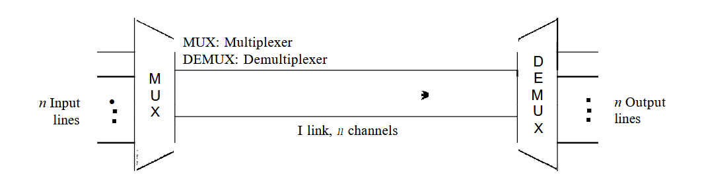
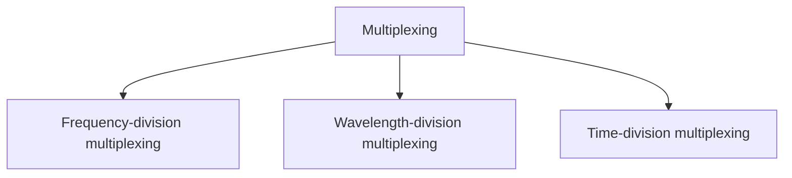
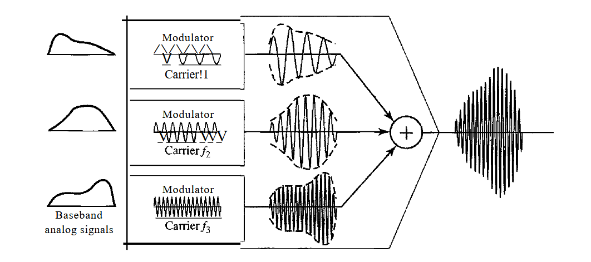
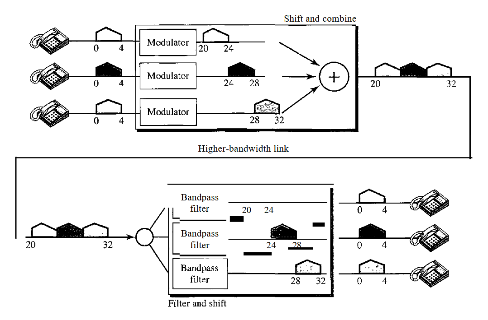
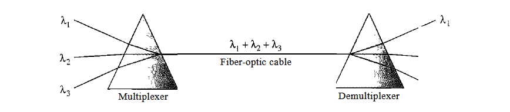
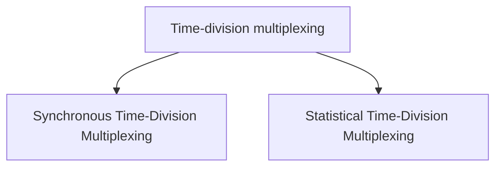

# Multiplexing

Multiplexing is the set of techniques that allows the simultaneous transmission of multiple signals across a single data link.

   
  <em>Figure 4.1.1: Dividing a link into channels</em>

In a multiplexed system, `n` lines share the bandwidth of one link. _Figure 4.1.1_ shows the basic format of a multiplexed system. The lines on the left direct their transmission streams to a multiplexer (MUX), which combines them into a single stream (many-to-one). At the receiving end, that stream is fed into a demultiplexer (DEMUX), which separates the stream back into its component transmissions (one-to-many) and directs them to their corresponding lines. In the figure, the word link refers to the physical path. The word channel refers to the portion of a link that carries a transmission between a given pair of lines. One link can have many `(n)` channels.

There are three basic multiplexing techniques:

- Frequency-division multiplexing,
- Wavelength-division multiplexing, and
- Time-division multiplexing

Frequency-division multiplexing and Wavelength-division multiplexing technique designed for analog signals, Time-division multiplexing technique for digital signals.

### Advantages of Multiplexing

1. More than one signal can be sent over a single medium.
2. The bandwidth of a medium can be utilized effectively.

### Why to use Multiplexing?

If no multiplexing is used between the users at two different sites that are distance apart, then separate communication lines would be required. This is not only costly but also become difficult to manage. If multiplexing is used then, only one line is required. This leads to the reduction in the line cost and also it would be easier to keep track of one line than several lines. If there are multiple signals to share one medium, then the medium must be divided in such a way that each signal is given some portion of the available bandwidth.

For example: If there are 10 signals and bandwidth of medium is 100 units, then the 10 unit is shared by each signal.

When multiple signals share the common medium, there is a possibility of collision. Multiplexing concept is used to avoid such collision.

## Frequency-Division Multiplexing

Frequency-Division Multiplexing (FDM) is a technique used to combine multiple analog signals into a single signal over a single cable. FDM is used to increase the capacity of a cable, allowing multiple signals to be sent simultaneously over the same cable.

<b>FDM is an analog multiplexing technique that combines analog signals.</b>

_Figure 4.1.2_ is a conceptual illustration of the multiplexing process. Each source generates a signal of a similar frequency range. Inside the multiplexer, these similar signals modulates different carrier frequencies ($f_1$, $f_2$ and $f_3$). The resulting modulated signals are then combined into a single composite signal that is sent out over a media link that has enough bandwidth to accommodate it.

   
  <em>Figure 4.1.2: Frequency-division multiplexing process</em>

### Example

Assume that a voice channel occupies a bandwidth of 4 kHz. We need to combine three voice channels into a link with a bandwidth of 12 kHz, from 20 to 32 kHz.

We shift (modulate) each of the three voice channels to a different bandwidth, as shown in _Figure 4.1.3_. We use the 20- to 24-kHz bandwidth for the first channel, the 24- to 28-kHz bandwidth for the second channel, and the 28- to 32-kHz bandwidth for the third one. Then we combine them as shown in _Figure 4.1.3_. At the receiver, each channel receives the entire signal, using a filter to separate out its own signal. The first channel uses a filter that passes frequencies between 20 and 24 kHz and filters out (discards) any other frequencies. The second channel uses a filter that passes frequencies between 24 and 28 kHz, and the third channel uses a filter that passes frequencies between 28 and 32 kHz. Each channel then shifts the frequency to start from zero.

   
  <em>Figure 4.1.3</em>

### Advantages of Frequency-Division Multiplexing

- **Simultaneous Transmission:** _FDM allows multiple signals to be transmitted simultaneously, each using a different frequency band. This is beneficial for continuous data streams (e.g., radio, TV broadcasting)._

- **Low Latency:** _Since all channels are transmitted at the same time, there is minimal delay in signal transmission._

- **Simple Synchronization:** _FDM does not require complex synchronization between channels, unlike TDM which needs precise timing._

- **Suitable for Analog Signals:** _FDM is ideal for analog signals, making it widely used in radio and television broadcasting._

### Disadvantages of Frequency-Division Multiplexing

- **Bandwidth Requirement:** _FDM requires a large bandwidth to accommodate multiple frequency bands, which may not be efficient for systems with limited spectrum._

- **Interference and Crosstalk:** _Adjacent channels can interfere with each other (crosstalk), requiring guard bands and precise filtering._

- **Complex Hardware:** _FDM systems need complex filters and modulators/demodulators, increasing hardware complexity and cost._

- **Less Efficient for Digital Data:** _FDM is less efficient for digital signals and bursty data traffic._

### Uses of Frequency-Division Multiplexing

- **Radio Broadcasting:** _Different radio stations transmit at different frequencies so multiple stations can broadcast simultaneously (eg. 92.7 MHz, 93.5 MHz)._

- **Television Broadcasting:** _Each TV channel is assigned a unique frequency band._

- **Satellite Communication:** _Satellites use FDM to transmit multiple signals (TV, internet, phone) simultaneously._

- **Telephone Systems (Older Analog Systems):** _Multiple voice calls were transmitted over a single line using different frequency ranges._

## Wavelength-Division Multiplexing

Wavelength-Division Multiplexing (WDM) is a technique used in fiber-optic communication where multiple data signals are transmitted simultaneously through a single optical fiber by using different wavelengths (colors) of light.

Wavelength-division multiplexing (WDM) is designed to use the high-data-rate
capability of fiber-optic cable. The optical fiber data rate is higher than the data rate of
metallic transmission cable. Using a fiber-optic cable for one single line wastes the
available bandwidth. Multiplexing allows us to combine several lines into one.

In WDM basic idea is very simple. We want to combine multiple light sources into one single light at the multiplexer and do the reverse at the demultiplexer. The combining and splitting of light sources are easily handled by a prism. Recall from basic physics that a prism bends a beam of light based on the angle of incidence and the frequency. Using this technique, a multiplexer can be made to combine several input beams of light, each containing a narrow band of frequencies, into one output beam of a wider band of frequencies. A demultiplexer can also be made to reverse the process. _Figure 4.1.4_ shows the concept.

   
  <em>Figure 4.1.4</em>

### Advantages of Wavelength-division multiplexing

- **Huge Data Capacity:** _Optical fibers can carry multiple wavelengths → extremely high bandwidth._

- **Efficient Use of Fiber:** _One fiber can carry many channels, reducing infrastructure cost._

- **Scalable:** _Easy to add more channels by introducing new wavelengths._

- **Low Signal Interference:** _Light wavelengths don’t interfere as much as electrical signals._

- **High-Speed Transmission:** _Supports modern internet, streaming, and cloud services._

### Disadvantages of Wavelength-division multiplexing

- **High Initial Cost:** _Equipment like lasers, multiplexers, and optical amplifiers are expensive._

- **Complex Technology:** _Requires precise control of wavelengths and advanced components._

- **Maintenance Difficulty:** _Troubleshooting fiber systems is harder than electrical systems._

- **Signal Attenuation & Dispersion:** _Light signals weaken and spread over long distances (needs amplification)._

### Uses of Wavelength-division multiplexing

- **Internet Backbone & Fiber Networks:** _Used by ISPs to carry massive internet traffic across countries and continents._

- **Submarine Communication Cables:** _Enables high-speed communication between continents through undersea fiber cables._

- **Telecom Networks:** _Used in modern telecom systems like FTTH (Fiber to the Home)._

## Time-Division Multiplexing

Time-Division Multiplexing (TDM) is a communication technique in which multiple signals share a single communication channel by dividing the transmission time into small time slots.

Each signal is transmitted one after another in rapid succession, but so fast that it appears simultaneous.

### Synchronous Time-Division Multiplexing

Synchronous TDM is a type of Time-Division Multiplexing where each device is assigned a fixed time slot in every cycle, regardless of whether it has data to send or not.

The communication channel is divided into equal time slots. Each device gets a predefined slot in every frame. Data is transmitted in a fixed sequence. Even if a device has no data, its slot remains empty (wasted). Not efficient when devices are inactive.

### Statistical (Asynchronous) Time-Division Multiplexing

Statistical TDM (also called Asynchronous TDM) is an improved version of Time-Division Multiplexing where time slots are assigned only to devices that actually have data to send.

Unlike synchronous TDM (where slots are fixed), statistical TDM is dynamic:

- No fixed slot for each device
- Slots are given on demand
- Only active devices use the channel

Data from multiple devices is stored in a buffer (queue). The multiplexer checks which device has data. It assigns time slots only to active devices. Each transmitted data block includes an address (ID) to identify the sender.

## Frequency Division Multiplexing (FDM) vs Wavelength Division Multiplexing (WDM) vs Time Division Multiplexing (TDM)

<table>
<thead>
  <tr>
  <th>Feature</th>
  <th>Frequency Division Multiplexing</th>
  <th>Wavelength Division Multiplexing</th>
  <th>Time Division Multiplexing</th>
  </tr>
</thead>

<tbody>
  <tr>
  <th>Basic Principle</th>
  <td>Divides bandwidth into different frequency bands</td>
  <td>Uses different light wavelengths (colors) in optical fiber</td>
  <td>Divides channel into time slots</td>
  </tr>

  <tr>
  <th>Signal Type</th>
  <td>Analog or digital signals</td>
  <td>Optical (light-based signals)</td>
  <td>Mostly digital signals</td>
  </tr>

  <tr>
  <th>Transmission Medium</th>
  <td>Copper cables, radio waves</td>
  <td>Optical fiber only</td>
  <td>Any medium (copper, fiber, wireless)</td>
  </tr>

  <tr>
  <th>Separation Method</th>
  <td>Frequency separation</td>
  <td>Wavelength (color) separation</td>
  <td>Time separation</td>
  </tr>

  <tr>
  <th>Simultaneous Transmission</th>
  <td>Yes (all signals sent at same time on different frequencies)</td>
  <td>Yes (multiple light signals simultaneously)</td>
  <td>No (signals sent one after another in time slots)</td>
  </tr>

  <tr>
  <th>Synchronization Needed</th>
  <td>Not required</td>
  <td>Not required</td>
  <td>Required (strict timing control)</td>
  </tr>

  <tr>
  <th>Bandwidth Usage</th>
  <td>Continuous spectrum divided</td>
  <td>Very high capacity (huge bandwidth in fiber)</td>
  <td>Shares full bandwidth but in time slices</td>
  </tr>

  <tr>
  <th>Efficiency</th>
  <td>Moderate (guard bands needed)</td>
  <td>Very high (efficient use of fiber)</td>
  <td>High (especially in digital systems)</td>
  </tr>

  <tr>
  <th>Complexity</th>
  <td>Moderate</td>
  <td>High (requires optical devices like lasers, prisms)</td>
  <td>Moderate to high (needs synchronization)</td>
  </tr>

  <tr>
  <th>Cost</th>
  <td>Lower</td>
  <td>Expensive (fiber + optical equipment)</td>
  <td>Moderate</td>
  </tr>

  <tr>
  <th>Interference</th>
  <td>Possible (adjacent channel interference)</td>
  <td>Very low</td>
  <td>Minimal</td>
  </tr>

  <tr>
  <th>Example</th>
  <td>Radio broadcasting, cable TV</td>
  <td>Fiber optic internet backbone</td>
  <td>Telephone systems, digital communication</td>
  </tr>
</tbody>
</table>

### Always Remember

FDM → “Different frequencies at the same time”

- 📻 Like multiple radio stations

WDM → “Different colors of light at the same time”

- 🌈 Used in high-speed fiber networks

TDM → “Same channel, different time slots”

- ⏱ Like people speaking one after another