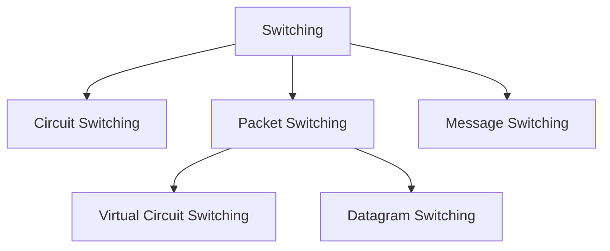
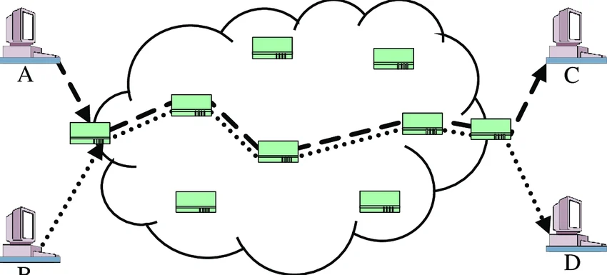
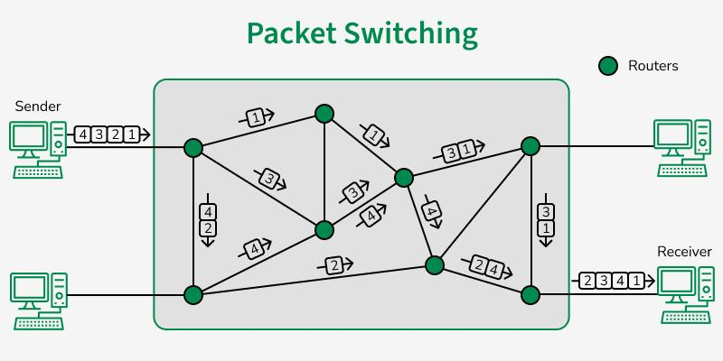
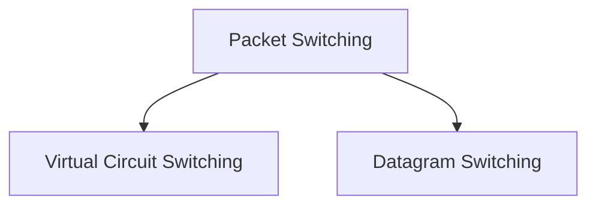
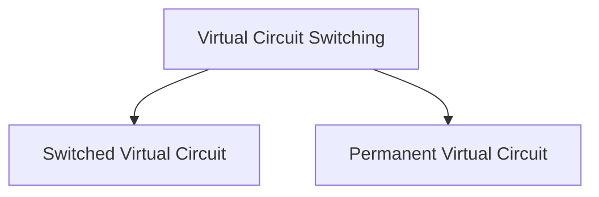

# Switching

Switching is a method of transferring data from one device to another through a network. It decides how data travels from sender to receiver.

_When you send a message, the network must decide which path to use — that decision process is called switching._

Traditionally, three methods of switching have been important: circuit switching,
packet switching, and message switching. The first two are commonly used today. The
third has been phased out in general communications but still has networking applications.

We can then divide today's networks into three broad categories: circuit-switched networks,
packet-switched networks, and message-switched. Packet-switched networks can funher
be divided into two subcategories-virtual-circuit networks and datagram networks



## Circuit Switching & Packet Switching

### Circuit Switching

A dedicated path is established before communication starts, and it remains reserved until communication ends.

<p align="center">
  <br>
  <em>Figure 4.2.1: Circuit Switching</em>
</p>

**Working:**

1. Connection setup (path created)

2. Data transfer

3. Connection termination

Example: _Traditional telephone calls_

### Packet Switching

Data is broken into small packets, and each packet travels independently through the network.

<p align="center">
  <br>
  <em>Figure 4.2.2: Packet Switching</em>
</p>

**Working:**

1. Data → divided into packets

2. Each packet → different routes

3. Reassembled at destination

Example: _Internet_

- In circuit switching, each data unit has entier path address.

- In packet switching, each data unit has destination address.

- Resource is reserved in circuit switching because bandwidth is dedicated.

- Resource is not reserved in packet switching because bandwidth is shared.

- Circuit switching is not store and forward technique because each packet has entire path address.

- Packet switching is store and forward technique.

- Wastage of resource more in circuit switching.

- In the case of circuit switching transmission of data is done by source, where as in packet switching transmission of data is done by not just only source, but also by intermediate nodes.

- In case of circuit switching delay between data packets is uniform (low jitter), where as delay between data packets in packet switching is variable (higher jitter).

```
CONGESTION: More number of packets are coming in less amount of time to the node, then the node buffer will be full no time, then the node is congested.
```

- In circuit switching, congestion can happen during connection establishment time.

- In packet switching, congestion can happen during data transfer time.

```
RELIABLE: Loss of Data is minimum.
```

- Circuit switching is reliable because path is dedicated. But packet switching is unreliable, because loss of data packet can be their.

```
FAULT TOLERANCE: Ability to continue operating properly, without interruption, despite the failure of one or more hardware or software components.
```

- Circuit switching is not fault-tolerant since it depends on a fixed path, whereas packet switching is fault-tolerant because packets can take alternate routes when a path fails.



#### Virtual Circuit Switching

Virtual Circuit Switching is a hybrid technique between Circuit Switching and Packet Switching.

- A logical (not physical) path is established first, and then all packets follow the same path.

- Not a real dedicated wire (like circuit switching). But behaves like one (fixed route for packets).



1. **Switched Virtual Circuit (SVC):**

- Created on demand
- Temporary connection

2. **Permanent Virtual Circuit (PVC)**

- Always available
- Pre-configured path

#### Datagram Switching

Datagram Switching is a type of Packet Switching where each packet is treated independently, no fixed path is established before transmission

Each packet (called a datagram) carries Source address, Destination address, Sequence information.

Data is divided into small packets (datagrams), each packet is sent independently, packets may take different routes, at destination packets are reassembled

- No connection setup required (connectionless)
- Highly flexible and robust
- Efficient use of network resources
- Packets may arrive out of order
- Possible delay or packet loss

### Message Switching

Message Switching is a technique where the entire message is sent as one unit, each intermediate node stores the message first, then forwards it, this is called Store-and-Forward Switching.

Sender sends the complete message, first node receives and stores it, then forwards it to the next node, this continues until it reaches the destination.

- No need for a dedicated path
- Messages can be routed dynamically
- Efficient use of network
- High delay (because of storing at each node)
- Requires large memory/storage
- Not suitable for real-time communication

## Circuit Switching vs Packet Switching vs Message Switching

| Feature / Parameter     | Circuit Switching                               | Packet Switching                                     | Message Switching                           |
| ----------------------- | ----------------------------------------------- | ---------------------------------------------------- | ------------------------------------------- |
| **Definition**          | Dedicated path established before communication | Data divided into packets and sent independently     | Entire message sent and stored at each node |
| **Connection Type**     | Connection-oriented                             | Connectionless (Datagram) / Connection-oriented (VC) | Connectionless                              |
| **Path**                | Fixed (dedicated)                               | Dynamic (changes per packet)                         | Dynamic (no fixed path)                     |
| **Data Unit**           | Continuous signal                               | Packets                                              | Whole message                               |
| **Setup Required**      | Yes                                             | No (Datagram), Yes (VC)                              | No                                          |
| **Transmission Method** | Continuous                                      | Packet-based                                         | Store-and-forward                           |
| **Delay**               | Low (after setup)                               | Medium (variable)                                    | High                                        |
| **Efficiency**          | Low (wastes bandwidth)                          | High                                                 | Medium                                      |
| **Reliability**         | High                                            | Moderate                                             | Moderate                                    |
| **Packet Order**        | Maintained                                      | Not guaranteed                                       | Maintained                                  |
| **Storage Requirement** | Low                                             | Low                                                  | High                                        |
| **Bandwidth Usage**     | Reserved                                        | Shared                                               | Shared                                      |
| **Failure Impact**      | Entire communication fails                      | Only some packets affected                           | Message delayed/retransmitted               |
| **Example**             | Telephone network                               | Internet (IP)                                        | Telegraph system                            |
| **Modern Usage**        | Rare (legacy systems)                           | Widely used                                          | Obsolete                                    |

## Virtual Circuit Switching vs Datagram Switching

| Feature / Parameter      | Virtual Circuit Switching                       | Datagram Switching                                      |
| ------------------------ | ----------------------------------------------- | ------------------------------------------------------- |
| **Definition**           | Logical path is established before sending data | No predefined path; each packet is routed independently |
| **Connection Type**      | Connection-oriented                             | Connectionless                                          |
| **Path**                 | Fixed (logical path)                            | Dynamic (changes per packet)                            |
| **Setup Required**       | Yes                                             | No                                                      |
| **Packet Routing**       | Same route for all packets                      | Each packet may take different routes                   |
| **Packet Order**         | Guaranteed (in order)                           | Not guaranteed                                          |
| **Delay**                | Low (after setup)                               | Variable                                                |
| **Overhead**             | Less (path decided once)                        | More (routing each packet)                              |
| **Reliability**          | Higher                                          | Lower                                                   |
| **Efficiency**           | High                                            | High                                                    |
| **Failure Handling**     | If path fails → communication breaks            | Packets rerouted automatically                          |
| **Example Technologies** | Frame Relay, ATM, MPLS                          | Internet Protocol (IP)                                  |
| **Real-world Use**       | Telecom networks, VPNs                          | Internet, web, email                                    |
