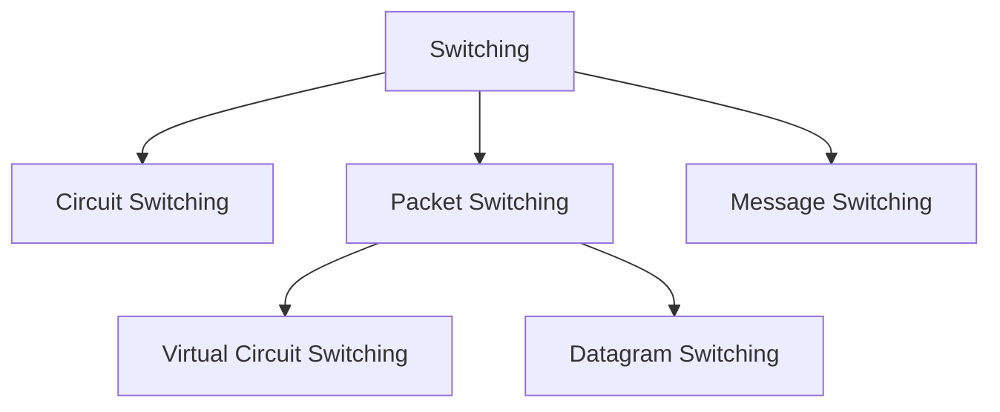

# Switching

Switching is a method of transferring data from one device to another through a network. It decides how data travels from sender to receiver.

_When you send a message, the network must decide which path to use — that decision process is called switching._

Traditionally, three methods of switching have been important: circuit switching,
packet switching, and message switching. The first two are commonly used today. The
third has been phased out in general communications but still has networking applications.

We can then divide today's networks into three broad categories: circuit-switched networks,
packet-switched networks, and message-switched. Packet-switched networks can funher
be divided into two subcategories-virtual-circuit networks and datagram networks



## Circuit Switching & Packet Switching

### Circuit Switching

A dedicated path is established before communication starts, and it remains reserved until communication ends.

<p align="center">
  <br>
  <em>Figure 4.2.1: Circuit Switching</em>
</p>

**Working:**

1. Connection setup (path created)

2. Data transfer

3. Connection termination

Example: *Traditional telephone calls*

### Packet Switching

Data is broken into small packets, and each packet travels independently through the network.

<p align="center">
  <br>
  <em>Figure 4.2.2: Packet Switching</em>
</p>

**Working:**

1. Data → divided into packets

2. Each packet → different routes

3. Reassembled at destination

Example: *Internet*

- In circuit switching, each data unit has entier path address.

- In packet switching, each data unit has destination address.

- Resource is reserved in circuit switching because bandwidth is dedicated.

- Resource is not reserved in packet switching because bandwidth is shared.

- Circuit switching is not store and forward technique because each packet has entire path address.

- Packet switching is store and forward technique.

- Wastage of resource more in circuit switching.

- In the case of circuit switching transmission of data is done by source, where as in packet switching transmission of data is done by not just only source, but also by intermediate nodes.

- In case of circuit switching delay between data packets is uniform (low jitter), where as delay between data packets in packet switching is variable (higher jitter).

```
CONGESTION: More number of packets are coming in less amount of time to the node, then the node buffer will be full no time, then the node is congested.
```

- In circuit switching, congestion can happen during connection establishment time.

- In packet switching, congestion can happen during data transfer time.

