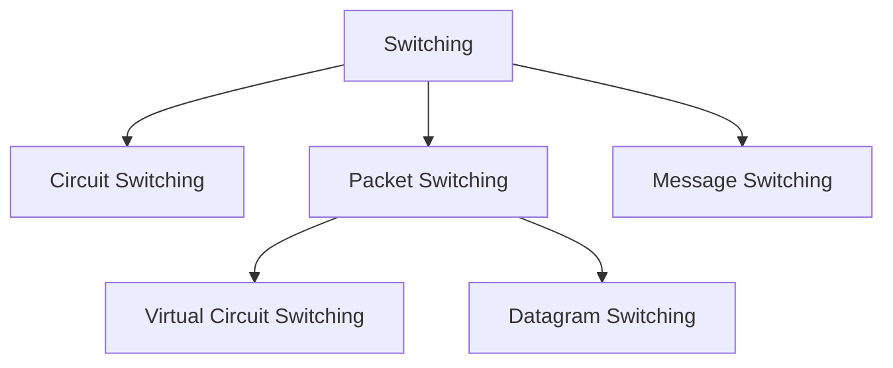

# Switching

Switching is a method of transferring data from one device to another through a network. It decides how data travels from sender to receiver.

*When you send a message, the network must decide which path to use — that decision process is called switching.*

Traditionally, three methods of switching have been important: circuit switching,
packet switching, and message switching. The first two are commonly used today. The
third has been phased out in general communications but still has networking applications.

We can then divide today's networks into three broad categories: circuit-switched networks,
packet-switched networks, and message-switched. Packet-switched networks can funher
be divided into two subcategories-virtual-circuit networks and datagram networks

