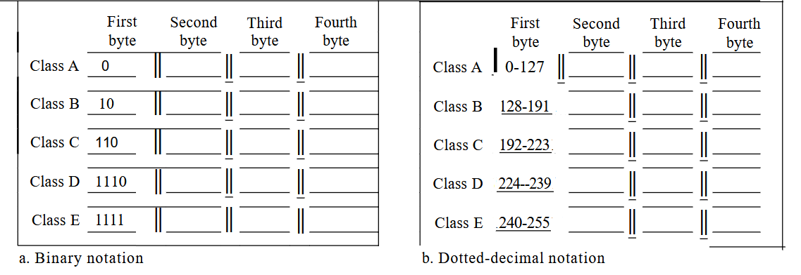
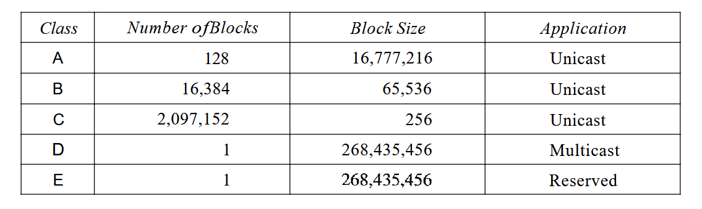
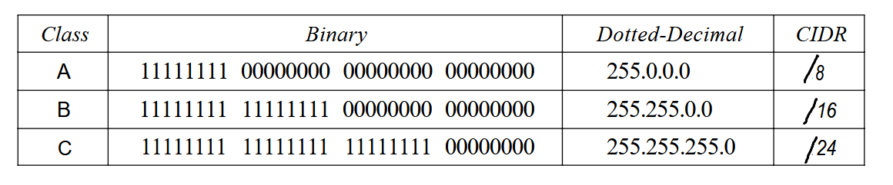
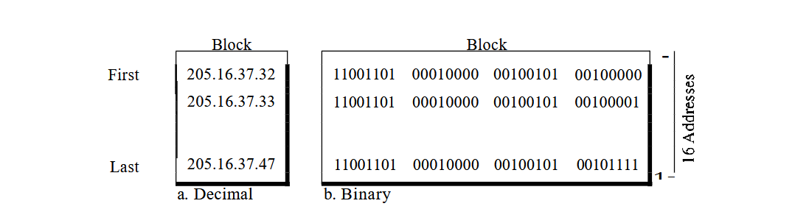

# IPv4 ADDRESSES

An IPv4 address is a 32-bit address that uniquely and universally defines the connection of a device (for example, a computer or a router) to the Internet.

<b>An IPv4 address is 32 bits long.</b>

IPv4 addresses are unique. They are unique in the sense that each address defines one, and only one, connection to the Internet. Two devices on the Internet can never have the same address at the same time.

## Address Space

An address space is the total number of addresses used by the protocol. If a protocol uses $N$ bits to define an address, the address space is $2^N$ because each bit can have two different values (0 or 1) and $N$ bits can have $2^N$ values.

IPv4 uses $32$-bit addresses, which means that the address space is $2^{32}$ or $4,294,967,296$ (more than 4 billion). This means that, theoretically, if there were no restrictions, more than 4 billion devices could be connected to the Internet.

## Notations

There are two prevalent notations to show an IPv4 address: binary notation and dotted-decimal notation.

### Binary Notation

In binary notation, the IPv4 address is displayed as $32$ bits. Each octet is often referred to as a byte. So it is common to hear an IPv4 address referred to as a $32$-bit address or a $4$-byte address. The following is an example of an IPv4 address in binary notation:

<i>01110101 10010101 00011101 00000010</i>

### Dotted-Decimal Notation

To make the IPv4 address more compact and easier to read, Internet addresses are usually written in decimal form with a decimal point (dot) separating the bytes. The following is the dotted~decimal notation of the above address:

<i>117.149.29.2</i>

_Figure 6.3.1_ shows an IPv4 address in both binary and dotted-decimal notation. Note that because each byte (octet) is $8$ bits, each number in dotted-decimal notation is a value ranging from $0$ to $255$.

   
  <em>Figure 6.3.1: Dotted-decimal notation and binary notation for an IPv4 address</em>

## Classful Addressing

IPv4 addressing, at its inception, used the concept of classes. This architecture is called classful addressing. Although this scheme is becoming obsolete.

In classful addressing, the address space is divided into five classes: A, B, C, D, and E. Each class occupies some part of the address space.

We can find the class of an address when given the address in binary notation or dotted-decimal notation. If the address is given in binary notation, the first few bits can immediately tell us the class of the address. If the address is given in decimal-dotted notation, the first byte defines the class. Both methods are shown in _Figure 6.3.2_

   
  <em>Figure 6.3.2: Dotted-decimal notation and binary notation for an IPv4 address</em>

### Classes and Blocks

One problem with classful addressing is that each class is divided into a fixed number of blocks with each block having a fixed size as shown in _Figure 6.3.3_

   
  <em>Figure 6.3.3: Number of blocks and block size in classful IPv4 addressing</em>

<b>In classful addressing, a large part of the available addresses were wasted</b>

### Netid and Hostid

In classful addressing, an IP address in class A, B, or C is divided into netid and hostid. These parts are of varying lengths, depending on the class of the address. _Table 6.3.4_ shows some netid and hostid bytes. Note that the concept does not apply to classes D and E.

In class A, one byte defines the netid and three bytes define the hostid. In class B, two bytes define the netid and two bytes define the hostid. In class C, three bytes define the netid and one byte defines the hostid.

### Mask

The length of the netid and hostid (in bits) is predetermined in classful addressing, we can also use a mask (also called the default mask), a $32$-bit number made of contiguous $1$'s followed by contiguous $0$'s. The masks for classes A, B, and C are shown in _Table 6.3.4_. The concept does not apply to classes D and E.

 
   
  <em>Table 6.3.4: Default masks for classful addressing</em>

The mask can help us to find the netid and the hostid. For example, the mask for a class A address has eight $1$'s, which means the first $8$ bits of any address in class A define the netid; the next $24$ bits define the hostid.

The last column of _Table 6.3.4_ shows the mask in the form $/n$ where $n$ can be $8$, $16$, or $24$ in classful addressing. This notation is also called slash notation or Classless Interdomain Routing (CIDR) notation. The notation is used in classless addressing.

### Subnetting

During the era of classful addressing, subnetting was introduced. If an organization was granted a large block in class A or B, it could divide the addresses into several contiguous groups and assign each group to smaller networks (called subnets) or, in rare cases, share part of the addresses with neighbors. Subnetting increases the number of $1$'s in the mask.

<i>Subnetting is the process of dividing a large network into smaller sub-networks (subnets).</i>

### Supernetting

The time came when most of the class A and class B addresses were depleted; however, there was still a huge demand for midsize blocks. The size of a class C block with a maximum number of $256$ addresses did not satisfy the needs of most organizations. Even a midsize organization needed more addresses. One solution was supernetting.

In supernetting, an organization can combine several class C blocks to create a larger range of addresses. In other words, several networks are combined to create a supernetwork or a supemet. An organization can apply for a set of class C blocks instead of just one. For example, an organization that needs 1000 addresses can be granted four contiguous class C blocks. The organization can then use these addresses to create one supernetwork. Supernetting decreases the number of Is in the mask. For example, if an organization is given four class C addresses, the mask changes from $/24$ to $/22$.

<i>Supernetting is the process of combining multiple smaller networks into one larger network.</i>

## Classless Addressing

Classless Addressing (CIDR – Classless Inter-Domain Routing) is a method of allocating IP addresses without fixed classes (A, B, C). It allows flexible division of network and host parts.

In classless addressing, IPs are assigned in blocks (groups of addresses). A block is a range of contiguous IP addresses given to an organization.

### Restriction

To simplify the handling of addresses, the Internet authorities impose
three restrictions on classless address blocks:

1. The addresses in a block must be contiguous, one after another.
2. The number of addresses in a block must be a power of $2 (1, 2, 4, 8, ... )$.
3. The first address must be evenly divisible by the number of addresses.

_Figure 6.3.5_ shows a block of addresses, in both binary and dotted-decimal notation, granted to a small business that needs 16 addresses.

 
   
  <em>Figure 6.3.5: A block of 16 addresses granted to a small organization</em>

We can see that the restrictions are applied to this block. The addresses are contiguous. The number of addresses is a power of $2$ $(16 = 2^4)$, and the first address is divisible by $16$.

### Mask

A better way to define a block of addresses is to select any address in the block and the mask. A mask is a $32$-bit number in which the $n$ leftmost bits are $1$'s and the $32 - n$ rightmost bits are $0$'s. However, in classless addressing the mask for a block can take any value from $0$ to $32$. It is very convenient to give just the value of $n$ preceded by a slash (CIDR notation).

In IPv4 addressing, a block of addresses can be defined as
$x.y.z.t/n$ in which $x.y.z.t$ defines one of the addresses and the $/n$ defines the mask.

The address and the $/n$ notation completely define the whole block (the first address, the last address, and the number of addresses).

#### First Address

The first address in the block can be found by setting the $32 - n$ rightmost bits in the binary notation of the address to $0$'s.

#### Last Address

The last address in the block can be found by setting the $32 - n$ rightmost bits in the binary notation of the address to $1$'s.

#### Number of Addresses

The number of addresses in the block is the difference between the last and first address. It can easily be found using the formula $2^{32- n}$
